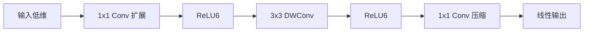

### **MobileNetV2 中的线性瓶颈（Linear Bottleneck）**  
**线性瓶颈** 是 MobileNetV2 的核心创新之一，用于解决深度可分离卷积中 **ReLU 激活函数的信息丢失问题**。其设计结合了 **倒残差结构（Inverted Residuals）**，显著提升了轻量级网络的表达能力。

---

#### **1. 传统瓶颈结构的问题**
在传统残差网络（如 ResNet）中，瓶颈结构采用 **“扩展→压缩”** 设计：
- **先通过 $1 \times 1$ 卷积扩展通道数**（增加维度）。
- **再用 $3 \times 3$ 卷积处理特征**。
- **最后用 $1 \times 1$ 卷积压缩通道数**（减少维度）。  

**问题**：当使用 ReLU 激活函数时，低维空间（压缩后）的激活值可能丢失大量信息（因 ReLU 对负值的截断）。

---

#### **2. 线性瓶颈的设计**
MobileNetV2 的改进：
- **取消最后一个 $1 \times 1$ 卷积后的 ReLU**，改为 **线性变换**（无激活函数）。  
- **保留高维空间（扩展层）的 ReLU**，避免信息丢失。  

**数学表达**：  
$$
\text{Bottleneck}(x) = \text{PointwiseConv}(\text{ReLU}(\text{DepthwiseConv}(\text{ReLU}(\text{PointwiseConv}(x))))
$$
- **最后一个 PointwiseConv 无 ReLU**，直接输出线性结果。

---

#### **3. 为什么需要线性瓶颈？**
- **低维空间的 ReLU 会破坏信息**：  
  假设压缩后的通道数极少（如 2~4 维），ReLU 可能将大部分神经元输出置零，导致特征不可逆丢失。  
  **示例**：若某通道在压缩后均值为负，ReLU 会直接将其置零，后续层无法恢复该信息。  
- **高维空间的 ReLU 更安全**：  
  扩展层（如从 24 维扩展到 144 维）的冗余度高，ReLU 仅丢弃部分激活值，不影响整体特征表达。

---

#### **4. 与倒残差结构的关系**
线性瓶颈需配合 **倒残差结构（Inverted Residuals）** 使用(stride=1的时候，高于1不建议使用)：
1. **先扩展**：通过 $1 \times 1$ 卷积将低维输入（如 24 维）扩展到高维（如 144 维）。  
2. **再深度卷积**：在高维空间进行 $3 \times 3$ 深度可分离卷积（保留更多信息）。  
3. **最后线性压缩**：用 $1 \times 1$ 卷积压缩回低维（如 24 维），**无 ReLU**。  



---

#### **5. 实验效果**
- **ImageNet 分类任务**：  
  - 使用线性瓶颈的 MobileNetV2 比 V1 准确率提升 **1.4%**（72.0% vs 70.6%），参数量反而减少 20%。  
- **信息保留验证**：  
  通过可视化特征图发现，线性瓶颈能保留更多细节特征（如边缘、纹理）。

---
#### **6. 线性瓶颈的数学解释**
线性瓶颈的合理性可以通过**流形学习理论**解释：
1. **低维流形假设**：真实数据通常存在于高维空间中的低维流形上。
2. **ReLU的破坏性**：在低维空间（如压缩后的通道）应用ReLU会切断流形结构，导致信息不可逆丢失。
3. **线性变换的优势**：保持流形结构的完整性，允许梯度在反向传播时更稳定地流动。

数学形式化表示：
$$
\text{若} \ z \in \mathbb{R}^d \ \text{是低维表示}, \ \text{则} \ \text{ReLU}(z) \ \text{可能将} \ z \ \text{投影到非光滑子空间}
$$
$$
\text{而线性变换} \ Wz \ \text{保持流形拓扑结构}
$$

---

#### **7. 实际应用中的变体**
#### (1) **ReLU6的替代方案**
- **h-swish**（MobileNetV3）：$h\text{-}swish(x) = x \cdot \frac{\text{ReLU6}(x+3)}{6}$
- **LeakyReLU**：保留少量负值信息

#### (2) **部分线性化**
某些实现仅在最后一个bottleneck使用线性激活，中间层仍保留ReLU：
```python
nn.Sequential(
    ConvBNReLU(in_ch, mid_ch, kernel=1),
    ConvBNReLU(mid_ch, mid_ch, kernel=3, groups=mid_ch),
    ConvBN(mid_ch, out_ch, kernel=1)  # 无ReLU
)
```

---

#### **8. 与其他轻量化技术的对比**
| 技术               | 核心思想     | 与线性瓶颈的关系       |
| ---------------- | -------- | -------------- |
| **ShuffleNet**   | 通道混洗+组卷积 | 可兼容（均避免通道压缩损失） |
| **EfficientNet** | 复合缩放     | 线性瓶颈作为基础组件     |
| **GhostNet**     | 特征冗余生成   | 替代方案（不同优化路径）   |

---

#### **9. 部署优化技巧**
1. **量化友好性**：
   - 线性激活使最后一层更适合INT8量化（无ReLU的数值范围限制）
2. **融合加速**：
   ```cpp
   // 典型GPU内核融合模式
   fused_ops = Conv1x1 + BN + Linear
   ```
3. **内存优化**：
   - 倒残差结构中的扩展层可临时分配内存，推理完成后立即释放

---

#### **10. 最新进展（2024）**
- **动态线性瓶颈**：根据输入特征自动调整压缩率
- **与注意力机制结合**：
  ```python
  class MobileViTBlock(nn.Module):
      def __init__(self):
          self.attn = Attention(dim)
          self.mbconv = InvertedResidual(dim)  # 含线性瓶颈
  ```
