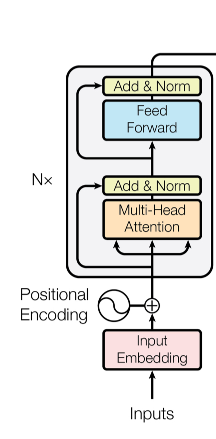
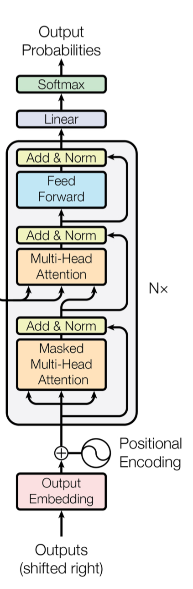

简单实例就是**语音识别**，输入的声波向量和输出的文字结果的数量一般来讲不会一一对应。输入和输出都是sequence，同时输出长度由模型决定，这样就是seq2seq的实际含义

只要存在语音和中文的**资料对应**，就可以直接训练一个语音翻译模型，将听到的语音直接翻译成中文

大部分的Natural Language Processing问题都是QA(Question Answering)问题，那么其实就是把`question`和`context`作为输入，将`answer`作为输出的一个seq2seq模型\[[1](https://arxiv.org/pdf/1806.08730)\]\[[2](https://arxiv.org/pdf/1909.03329)\]

seq2seq是可以**硬解**一些问题，比方说分析一个句子的文法，可以讲句子作为输入，文法树的特定结构作为输出(e.g. {S {NP deep learning} {VP is {ADJV very powerful} } })，并且这种处理方式存在[实例](https://arxiv.org/pdf/1412.7449)

通过seq2seq硬做Multi-label Classification任务\[[1](https://arxiv.org/pdf/1909.03434)\]\[[2](https://arxiv.org/pdf/1707.05495)\]

也可以通过seq2seq来做object detection(图片处理)\[[1](https://arxiv.org/pdf/2005.12872)\]

### How to do seq2seq(Transformer)
需要一个encoder和一个decoder来处理这种架构的问题，现在主流操作是[Transformer](https://arxiv.org/pdf/1706.03762)(后文图片来源)

#### Encoder
Encoder使用self-attention来处理，在每个输入进行self-attention操作后，还要进行**residual connection**，即将输入和self-attention的结果进行**加和**，再进行layer normalization(对**一个向量本身**计算均值和标准差，然后再标准化处理)。然后将结果经过一个Fully Connected NN，再进行一次residual connection，再最后layer normalization后就是**Encoder输出**了

#### Autoregressive Decoder
使用**语音识别**作为例子，Decoder会以Encoder的输出向量作为输入，然后需要给Decoder一个开始符号\<BOS\>，其输出是**大小为所有常规字符**的向量(经softmax后)，这个向量就相当于是这个输入可能对应的字符的**概率**。一般取最高概率的字符作为**下一阶段的输入**，然后不断生成直到生成结束。

masked self-attention就是不考虑当前向量右边的向量，只考虑**本身及左边的向量**(类似RNN)，因为Decoder的输出不能以**平行**思考，是有顺序输出的，所以需要进行masked操作

为了让句子会存在结尾，所以输出向量中还需要增加一个**结束符号**

#### Non-autoregressive(NAT)
设计一个分析器，其吃Encoder的输出，可以得到Decoder中应该输出的字符个数。然后Decoder只需要投入此个数的\<BOS\>，就可以直接生成整个句子。或者直接投入十分多个\<BOS\>，遇到结束符号后直接停止，无视后续的\<BOS\>。**平行**思考，输出长度可控。[参考视频](https://youtu.be/jvyKmU4OM3c)

#### Encoder和Decoder
Decoder的中间是一个**cross attention**，其输入即是**Encoder的输出**又是**Decoder第一阶段的输出**

masked self-attention产生的向量变成query向量$q$，然后把Encoder每个输出都去计算$k和v$，再用$q$去产生attention计算出最终输出结果，这就是cross attention的过程\[[1](https://ieeexplore.ieee.org/document/7472621)\]

也有人尝试了很多种多样的cross attention方式，具体可以看这个[参考文献](https://arxiv.org/pdf/2005.08081)

#### Training
类似**分类**，每一次产生的结果向量和其实际情况(ground truth)进行一个cross entropy的计算，使其**最小化**就是训练的目标。只要给全ground truth，训练的时候Decoder输入也选择ground truth，然后再用cross entropy思路训练，这种操作叫做**teacher frocing**。

#### Tips
##### Copy Mechanism 复制机制
有些seq2seq(写论文摘要)需要直接从输入复制部分内容到结果之中，这样就可以一定程度上减少一些计算\[[1](https://arxiv.org/pdf/1603.06393)\]
##### Guided Attention
引导式注意力机制。在训练的时候可能会出现一些小错误，例如**语音输出**，当输入字符很少的时候可能会漏字。利用guided attention就能让它不会**缺失输入**，一定看完一整句话，规定attention的**观察顺序**

关键词：Monotonic Attention，Location-aware attention
##### Beam Search
[笔记中同内容部分](../RNN条件生成与Attention机制/条件生成与Attention#^4fe874)
每次选最大是一个**greedy decoding**，而最好情况可能并不是每次选最大，解决方法看上面链接

这个操作不一定是很好的，可能会**不断输出重复的内容**\[[1](https://arxiv.org/pdf/1904.09751)\]

decoder需要**随机性**，而不是永远选最好的(**Temperature**机制)

#### Exposure bias
由于在训练的时候使用了teacher forcing，所以如果在test过程中输出了错误的结果，就可能导致**一步错步步错**，所以要使用schedule sampling\[[1](https://arxiv.org/pdf/1506.03099)\]\[[2](https://arxiv.org/pdf/1906.07651)\]\[[3](https://arxiv.org/pdf/1906.04331)\]，但可能会伤害transformer的本身特征
