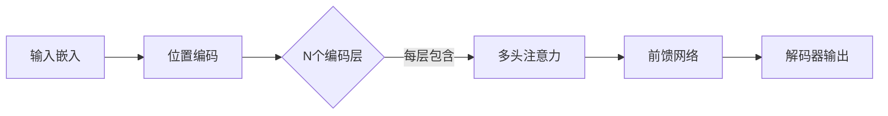

《Attention Is All You Need》是2017年由Google提出的划时代论文，首次提出**Transformer架构**，彻底改变了NLP领域的发展方向。以下是核心内容精要：

---

### 1. **核心创新：Transformer模型**
- **完全基于注意力机制**：抛弃传统的RNN/CNN，仅用[自注意力机制](自注意力机制.md)（Self-Attention）处理序列
- **关键组件**：
  - **多头注意力**（Multi-Head Attention）：**并行**学习不同子空间的注意力模式
  - **位置编码**（Positional Encoding）：用$sin/cos$函数注入位置信息，替代RNN的时序处理
  - **层归一化**（[LayerNorm](../Normalization/Layer%20Normalization.md)）和残差连接：稳定深层网络训练

---

### 2. **模型架构**

- **编码器-解码器结构**：
  - 编码器：**6层**相同结构，每层含自注意力+前馈网络
  - 解码器：额外加入**掩码多头注意力**（确保预测时仅看到历史信息）

---

### 3. **核心公式**
- **缩放点积注意力**：
  $$
  \text{Attention}(Q,K,V) = \text{softmax}\left(\frac{QK^T}{\sqrt{d_k}}\right)V
  $$其中$d_k$指的是key向量的维度大小
- **多头注意力**：
  $$
  \text{MultiHead}(Q,K,V) = \text{Concat}(\text{head}_1,...,\text{head}_h)W^O
  $$$$\text{where}\ head_i=\text{Attention}(QW_i^Q,KW_i^K,VW_i^V)$$

---

### 4. **重要影响**
- **性能突破**：在WMT2014英德翻译任务达到28.4 BLEU（比当时最佳提升2 BLEU）
- **衍生模型**：直接催生了`BERT`、`GPT`等里程碑模型
- **开源实现**：论文代码已集成到主流框架（如TensorFlow/PyTorch）
