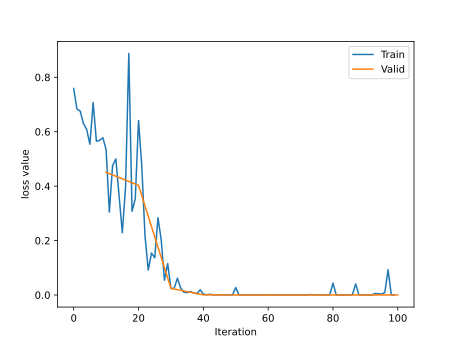

## 人民币 二分类

^0be56e

实现1元人民币和100元人民币的图片二分类

针对数据模块，可以分为四个部分
* 数据收集: 样本和标签
* 数据划分: 训练集、验证集和测试机
* 数据读取: 对应于PyTorch的DataLoader，其中又包括Sampler和DataSet，前者生成索引，后者根据索引读取样本以及标签
* 数据预处理: 对应于PyTorch的tansforms

### DataLoader和DataSet
##### torch.utils.data.DataLoader()
```python
torch.utils.data.DataLoader(dataset, batch_size=1, shuffle=False, sampler=None, batch_sampler=None, num_workers=0, collate_fn=None, pin_memory=False, drop_last=False, timeout=0, worker_init_fn=None, multiprocessing_context=None)
# 构建可迭代的数据装载器
```
- dataset: Dataset 类，决定数据从哪里读取以及如何读取
- batchsize: 批大小
- num_works: 是否多进程读取数据
- sheuffle: 每个 epoch 是否乱序
- drop_last: 当样本数不能被 batchsize 整除时，是否舍弃最后一批数据

##### Epoch，Iteration，Batchsize
- Epoch: 所有训练样本都已经输入到模型中，称为一个 Epoch
- Iteration: 一批样本输入到模型中，称为一个 Iteration
- Batchsize: 批大小，决定一个 iteration 有多少样本，也决定了一个 Epoch 有多少个 Iteration

假设样本总数有 80，设置 Batchsize 为 8，则共有 $80÷8=10$ 个 Iteration。这里 $1\ Epoch=10\ Iteration$。

假设样本总数有 86，设置 Batchsize 为 8。如果`drop_last=True`则共有 10 个 Iteration；如果`drop_last=False`则共有 11 个 Iteration。

##### torch.utils.data.Dataset
**抽象类**，所有自定义的Dataset都要继承这个类，并且必须重写`__getitem__()`和`__len__()`方法，前者接受一个索引，返回索引对应的样本和标签；后者返回所有样本的数量。

数据读取包含三个方面的读取
- **读取哪些数据**：每个 Iteration 读取一个 Batchsize 大小的数据，每个 Iteration 应该读取哪些数据。
- **从哪里读取数据**：如何找到硬盘中的数据，应该在哪里设置文件路径参数
- **如何读取数据**：不同的文件需要使用不同的读取方法和库。

首先需要将数据集划分为**训练集**，**验证集**和**测试集**，比例大概是8:1:1

即创建一个文件夹**路径树**如下
* rmb_split
	* train
		* 1
		* 100
	* valid
		* 1
		* 100
	* test
		* 1
		* 100

其中文件夹1存放一元人民币的图片，文件夹100存一百元人民币的图片

为了读取数据的Dataset，就需要编写一个读取数据的方法，代码如下
```python
    @staticmethod
    def get_img_info(data_dir):
        data_info = list()
        # data_dir 是训练集、验证集或者测试集的路径
        for root, dirs, _ in os.walk(data_dir):
            # 遍历类别
            # dirs ['1', '100']
            for sub_dir in dirs:
                # 文件列表
                img_names = os.listdir(os.path.join(root, sub_dir))
                # 取出 jpg 结尾的文件
                img_names = list(filter(lambda x: x.endswith('.jpg'), img_names))
                # 遍历图片
                for i in range(len(img_names)):
                    img_name = img_names[i]
                    # 图片的绝对路径
                    path_img = os.path.join(root, sub_dir, img_name)
                    # 标签，这里需要映射为 0、1 两个类别，这里按照1元还是100元进行了划分
                    label = rmb_label[sub_dir]
                    # 保存在 data_info 变量中
                    data_info.append((path_img, int(label)))
        return data_info
```

然后在初始化Dataset的时候调用这个方法
```python
    def __init__(self, data_dir, transform=None):
        """
        rmb面额分类任务的Dataset
        :param data_dir: str, 数据集所在路径
        :param transform: torch.transform，数据预处理
        """
        # data_info存储所有图片路径和标签，在DataLoader中通过index读取样本
        self.data_info = self.get_img_info(data_dir)
        self.transform = transform
```

按照上文所说，需要重写`__getitem__()`方法，依据`index`读取`self.data_info`中对应的数据，并做transform操作
```python
    def __getitem__(self, index):
        # 通过 index 读取样本
        path_img, label = self.data_info[index]
        # 注意这里需要 convert('RGB')
        img = Image.open(path_img).convert('RGB')     # 0~255
        if self.transform is not None:
            img = self.transform(img)   # 在这里做transform，转为tensor等等
        # 返回是样本和标签
        return img, label
```

同样要重写`__len__()`方法，返回`self.data_info`的长度，即样本的数量
```python
# 返回所有样本的数量
    def __len__(self):
        return len(self.data_info)
```

这样就算是完成Dataset的自定义了，接下来是对模型学习的本体进行分析，总共分为五步

第一步设置数据，定义每个文件夹的路径，定义对应的transform，构建训练集和验证集的`RMBDataset`对象，再传入路径和transform，构建`DataLoader`，设置batch_size，设置`shuffle=True`让每个Epoch打乱样本
```python
# 构建MyDataset实例train_data = RMBDataset(data_dir=train_dir, transform=train_transform)valid_data = RMBDataset(data_dir=valid_dir, transform=valid_transform)

# 构建DataLoder
# 其中训练集设置 shuffle=True，表示每个 Epoch 都打乱样本
train_loader = DataLoader(dataset=train_data, batch_size=BATCH_SIZE, shuffle=True)
valid_loader = DataLoader(dataset=valid_data, batch_size=BATCH_SIZE)
```

第二部设置模型，这里直接采用Lenet图片分类网络
```python
net = LeNet(classes=2)
net.initialize_weights()
```

第三步设置损失函数，使用CrossEntropy损失函数
```python
criterion = nn.CrossEntropyLoss()
```

第四步设置优化器，采用SGD优化器
```python
optimizer = optim.SGD(net.parameters(), lr=LR, momentum=0.9)                        # 选择优化器
scheduler = torch.optim.lr_scheduler.StepLR(optimizer, step_size=10, gamma=0.1)     # 设置学习率下降策略
```

第五步迭代训练模型，每次经历epoch，都要遍历train_loader取数据，每次都取一个batchsize大小。然后做下面四步:向前传播、反向传播、optimizer优化器更新权重、统计训练情况。每一个epoch都要使用`scheduler`更新学习率，计算**验证集**的准确率及loss
```python
for epoch in range(MAX_EPOCH):

    loss_mean = 0.
    correct = 0.
    total = 0.

    net.train()
    # 遍历 train_loader 取数据
    for i, data in enumerate(train_loader):

        # forward
        inputs, labels = data
        outputs = net(inputs)

        # backward
        optimizer.zero_grad()
        loss = criterion(outputs, labels)
        loss.backward()

        # update weights
        optimizer.step()

        # 统计分类情况
        _, predicted = torch.max(outputs.data, 1)
        total += labels.size(0)
        correct += (predicted == labels).squeeze().sum().numpy()

        # 打印训练信息
        loss_mean += loss.item()
        train_curve.append(loss.item())
        if (i+1) % log_interval == 0:
            loss_mean = loss_mean / log_interval
            print("Training:Epoch[{:0>3}/{:0>3}] Iteration[{:0>3}/{:0>3}] Loss: {:.4f} Acc:{:.2%}".format(
                epoch, MAX_EPOCH, i+1, len(train_loader), loss_mean, correct / total))
            loss_mean = 0.

    scheduler.step()  # 更新学习率
    # 每个 epoch 计算验证集得准确率和loss
    ...
    ...
```

通过向下查询函数，可以发现迭代iteration过程中，最终会到一个`fetch()`函数，它拿到的`data`是一个list，每个元素是一个tuple，每个tuple包含**样本**以及**标签**，需要用`self.collate_fn(data)`把data转换成两个list，这就是为什么需要使用`input, labels = data`来接受最终的数据<br>


总结一下，首先在 for 循环中遍历`DataLoader`，然后根据**是否采用多进程**，决定使用单进程或者多进程的`DataLoaderIter`。在`DataLoaderIter`里调用`Sampler`生成`Index`的 list，再调用`DatasetFetcher`根据`index`获取数据。在`DatasetFetcher`里会调用`Dataset`的`__getitem__()`方法获取真正的数据。这里获取的数据是一个 list，其中每个元素是 `(img, label) `的**元组**，再使用 `collate_fn()`函数整理成一个 list，里面包含两个元素，分别是 img 和 label 的`tenser`。

附上这个小项目的最终loss曲线结果图<br>

