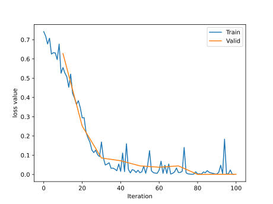

标准化操作，可以转至[[../Normalization/批次标准化|批次标准化]]学习原理

### Batch Normalization
将一个batch的数据处理后服从$N(0,1)$的正态分布

优点：
- 可以使用**更大的学习率**，加速模型收敛
- 可以不用精心设计**权值初始化**
- 可以不用 dropout 或者较小的 dropout
- 可以不用 L2 或者较小的 weight decay
- 可以不用 LRN (local response normalization)

假设输入的mini-batch数据是$B=\{x_{1...m}\}$，学习参数是$\gamma,\beta$，那么步骤如下
* 求均值$\mu_B\leftarrow\frac{1}{m}\sum_{i=1}^mx_i$
* 求方差$\sigma_B^2\leftarrow\frac{1}{m}\sum_{i=1}^m(x_i-\mu_B)^2$
* 标准化$\hat{x_i}\leftarrow\frac{x_i-\mu_B}{\sqrt{\sigma_B^2+\epsilon}}$，其中$\epsilon$是为了防止除0的小系数
* affine transform(缩放和平移)$$y_i\leftarrow \gamma \hat{x_i}+\beta\equiv \text{BN}_{\gamma,\beta}(x_i)$$这个操作可以增强模型的capacity，即让模型自己判断是否需要进行标准化，进行多少大程度的标准化，如果$\gamma=\sqrt{\sigma_B^2}$，$\beta=\mu_B$，那么就实现了**恒等映射**

通过增加批次标准化，对RMB实例再次进行训练，对比[[DataLoader与DataSet#^df8ab8|没有标准化的结果图]]，就可以看到loss整体曲线比较平滑稳定<br>

### Batch Normalization in PyTorch
存在三个Batch Normalization的类
- nn.BatchNorm1d()，输入数据的形状是 $B\times C\times1\text{D\_feature}$
- nn.BatchNorm2d()，输入数据的形状是 $B\times C\times \text{2D\_feature}$
- nn.BatchNorm3d()，输入数据的形状是 $B\times C\times\text{3D\_feature}$

```python
torch.nn.BatchNorm1d(num_features, eps=1e-05, momentum=0.1, affine=True, track_running_stats=True)
```
- `num_features`：一个样本的特征数量，这个参数最重要
- `eps`：在进行标准化操作时的分布修正项
- `momentum`：指数加权平均估计当前的均值和方差
- `affine`：是否需要 affine transform，默认为 True
- `track_running_stats`：True 为训练状态，此时均值和方差会根据每个 mini-batch 改变。False 为测试状态，此时均值和方差会固定

主要属性
- `runninng_mean`：均值
- `running_var`：方差
- `weight`：affine transform 中的$\gamma$
- `bias`：affine transform 中的$\beta$

在训练时，均值和方差采用**指数加权平均计算**，也就是不仅考虑当前 mini-batch 的值均值和方差还考虑前面的 mini-batch 的均值和方差

所有的 BN 层都是根据**特征维度**计算上面 4 个属性

**有几个特征就算几个均值和方差**
### nn.BatchNorm1d()
输入数据的形状是 $B\times C\times1\text{D\_feature}$，即$B$个样本，$C$个特征，$\text{D\_feature}$个特征维度

下面的例子数据维度是`(3,5,1)`


示例代码
```python
    batch_size = 3
    num_features = 5
    momentum = 0.3

    features_shape = (1)

    feature_map = torch.ones(features_shape)                                                    # 1D
    feature_maps = torch.stack([feature_map*(i+1) for i in range(num_features)], dim=0)         # 2D
    feature_maps_bs = torch.stack([feature_maps for i in range(batch_size)], dim=0)             # 3D
    print("input data:\n{} shape is {}".format(feature_maps_bs, feature_maps_bs.shape))

    bn = nn.BatchNorm1d(num_features=num_features, momentum=momentum)

    running_mean, running_var = 0, 1
    mean_t, var_t = 2, 0
    for i in range(2):
        outputs = bn(feature_maps_bs)

        print("\niteration:{}, running mean: {} ".format(i, bn.running_mean))
        print("iteration:{}, running var:{} ".format(i, bn.running_var))


        running_mean = (1 - momentum) * running_mean + momentum * mean_t
        running_var = (1 - momentum) * running_var + momentum * var_t

        print("iteration:{}, 第二个特征的running mean: {} ".format(i, running_mean))
        print("iteration:{}, 第二个特征的running var:{}".format(i, running_var))
```

输出如下
```text
input data:
tensor([[[1.],
         [2.],
         [3.],
         [4.],
         [5.]],

        [[1.],
         [2.],
         [3.],
         [4.],
         [5.]],

        [[1.],
         [2.],
         [3.],
         [4.],
         [5.]]]) shape is torch.Size([3, 5, 1])

iteration:0, running mean: tensor([0.3000, 0.6000, 0.9000, 1.2000, 1.5000]) 
iteration:0, running var:tensor([0.7000, 0.7000, 0.7000, 0.7000, 0.7000]) 
iteration:0, 第二个特征的running mean: 0.6 
iteration:0, 第二个特征的running var:0.7

iteration:1, running mean: tensor([0.5100, 1.0200, 1.5300, 2.0400, 2.5500]) 
iteration:1, running var:tensor([0.4900, 0.4900, 0.4900, 0.4900, 0.4900]) 
iteration:1, 第二个特征的running mean: 1.02 
iteration:1, 第二个特征的running var:0.48999999999999994
```

虽然两个mini-batch的数据是一样的，但是BN层的均值和方差是不一样的

### nn.BatchNorm2d()
下面的例子数据的维度是`(3,3,2,2)`，表示有3个样本，每个样本3个特征，每个特征的维度是$2\times 2$


示例代码
```python
    batch_size = 3
    num_features = 3
    momentum = 0.3

    features_shape = (2, 2)

    feature_map = torch.ones(features_shape)                                                    # 2D
    feature_maps = torch.stack([feature_map*(i+1) for i in range(num_features)], dim=0)         # 3D
    feature_maps_bs = torch.stack([feature_maps for i in range(batch_size)], dim=0)             # 4D

    # print("input data:\n{} shape is {}".format(feature_maps_bs, feature_maps_bs.shape))

    bn = nn.BatchNorm2d(num_features=num_features, momentum=momentum)

    running_mean, running_var = 0, 1

    for i in range(2):
        outputs = bn(feature_maps_bs)

        print("\niter:{}, running_mean: {}".format(i, bn.running_mean))
        print("iter:{}, running_var: {}".format(i, bn.running_var))

        print("iter:{}, weight: {}".format(i, bn.weight.data.numpy()))
        print("iter:{}, bias: {}".format(i, bn.bias.data.numpy()))
```

输出如下
```text
iter:0, running_mean: tensor([0.3000, 0.6000, 0.9000])
iter:0, running_var: tensor([0.7000, 0.7000, 0.7000])
iter:0, weight: [1. 1. 1.]
iter:0, bias: [0. 0. 0.]
iter:1, running_mean: tensor([0.5100, 1.0200, 1.5300])
iter:1, running_var: tensor([0.4900, 0.4900, 0.4900])
iter:1, weight: [1. 1. 1.]
iter:1, bias: [0. 0. 0.]
```

### nn.BatchNorm3d()
下面的例子数据维度是`(3,3,2,2,3)`，有3个样本，每个样本3个特征，每个特征的维度是$2\times 2\times 3$


代码示例
```python
    batch_size = 3
    num_features = 3
    momentum = 0.3

    features_shape = (2, 2, 3)

    feature = torch.ones(features_shape)                                                # 3D
    feature_map = torch.stack([feature * (i + 1) for i in range(num_features)], dim=0)  # 4D
    feature_maps = torch.stack([feature_map for i in range(batch_size)], dim=0)         # 5D

    # print("input data:\n{} shape is {}".format(feature_maps, feature_maps.shape))

    bn = nn.BatchNorm3d(num_features=num_features, momentum=momentum)

    running_mean, running_var = 0, 1

    for i in range(2):
        outputs = bn(feature_maps)

        print("\niter:{}, running_mean.shape: {}".format(i, bn.running_mean.shape))
        print("iter:{}, running_var.shape: {}".format(i, bn.running_var.shape))

        print("iter:{}, weight.shape: {}".format(i, bn.weight.shape))
        print("iter:{}, bias.shape: {}".format(i, bn.bias.shape))
```

输出如下
```text
iter:0, running_mean.shape: torch.Size([3])
iter:0, running_var.shape: torch.Size([3])
iter:0, weight.shape: torch.Size([3])
iter:0, bias.shape: torch.Size([3])
iter:1, running_mean.shape: torch.Size([3])
iter:1, running_var.shape: torch.Size([3])
iter:1, weight.shape: torch.Size([3])
iter:1, bias.shape: torch.Size([3])
```

### Layer Normalization
由于Batch Normalization不适用于变长的网络，例如RNN，[[../Normalization/Layer Normalization|原理]]

对每个网络层计算均值和方差，不再存在`running_mean`和`running_var`，同时$\gamma$和$\beta$是逐样本的

```python 
torch.nn.LayerNorm(normalized_shape, eps=1e-05, elementwise_affine=True) 
```
- `normalized_shape`：该层特征的形状，可以取 $C\times H\times W$、$H\times W$、$W$
- `eps`：标准化时的分母修正项
- `elementwise_affine`：是否需要逐个样本 affine transform

代码示例
```python
    batch_size = 8
    num_features = 2

    features_shape = (3, 4)

    feature_map = torch.ones(features_shape)  # 2D
    feature_maps = torch.stack([feature_map * (i + 1) for i in range(num_features)], dim=0)  # 3D
    feature_maps_bs = torch.stack([feature_maps for i in range(batch_size)], dim=0)  # 4D

    # feature_maps_bs shape is [8, 6, 3, 4],  B * C * H * W
    # ln = nn.LayerNorm(feature_maps_bs.size()[1:], elementwise_affine=True)
    # ln = nn.LayerNorm(feature_maps_bs.size()[1:], elementwise_affine=False)
    # ln = nn.LayerNorm([6, 3, 4])
    ln = nn.LayerNorm([2, 3, 4])

    output = ln(feature_maps_bs)

    print("Layer Normalization")
    print(ln.weight.shape)
    print(feature_maps_bs[0, ...])
    print(output[0, ...])
```

输出如下
```text
Layer Normalization
torch.Size([2, 3, 4])
tensor([[[1., 1., 1., 1.],
         [1., 1., 1., 1.],
         [1., 1., 1., 1.]],
        [[2., 2., 2., 2.],
         [2., 2., 2., 2.],
         [2., 2., 2., 2.]]])
tensor([[[-1.0000, -1.0000, -1.0000, -1.0000],
         [-1.0000, -1.0000, -1.0000, -1.0000],
         [-1.0000, -1.0000, -1.0000, -1.0000]],
        [[ 1.0000,  1.0000,  1.0000,  1.0000],
         [ 1.0000,  1.0000,  1.0000,  1.0000],
         [ 1.0000,  1.0000,  1.0000,  1.0000]]], grad_fn=<SelectBackward>)
```

### Instance Normalization
Batch Normalization 不适用于图像生成，在一个 mini-batch 中的图像有不同的风格，不能把这个 batch 里的数据都看作是同一类取标准化

逐个 instance 的 channel 计算均值和方差。也就是每个 feature map 计算一个均值和方差

```python
torch.nn.InstanceNorm1d(num_features, eps=1e-05, momentum=0.1, affine=False, track_running_stats=False)
```
- `num_features`：一个样本的特征数，这个参数最重要
- `eps`：分母修正项
- `momentum`：指数加权平均估计当前的的均值和方差
- `affine`：是否需要 affine transform
- `track_running_stats`：True 为训练状态，此时均值和方差会根据每个 mini-batch 改变。False 为测试状态，此时均值和方差会固定

### Group Normalization
在小 batch 的样本中，Batch Normalization 估计的值不准。一般用在很大的模型中，这时 batch size 就很小

数据不够，通道来凑。 每个样本的特征分为几组，每组特征分别计算均值和方差。可以看作是 Layer Normalization 的基础上添加了特征分组

注意事项
- 不再有 `running_mean` 和 `running_var`  
- $\gamma$ 和 $\beta$ 为逐通道的

```python
torch.nn.GroupNorm(num_groups, num_channels, eps=1e-05, affine=True)
```
- `num_groups`：特征的分组数量
- `num_channels`：特征数，通道数。注意 `num_channels` 要可以整除 `num_groups`
- `eps`：分母修正项
- `affine`：是否需要 affine transform


