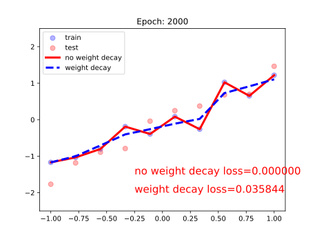
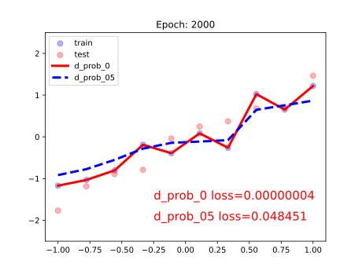

主要内容是正则化与偏差-方差分解，以及pytorch中的L2正则项

### Regularization
**正则化**，是一种减少方差的策略(**防止过拟合**)，机器学习中，误差可以分解为
* 偏差，度量了学习算法的期望预测与真实结果的偏离程度，刻画了算法本身的拟合能力
* 方差，度量了同样大小的训练集的变动所导致的学习性能的变化，刻画了数据扰动所造成的影响
* 噪声，表达了在当前学习任务上学习**任何算法**所能达到的期望泛化误差的下界

正则化方式存在L1和L2正则项两种，其中L2正则项又被称为**权值衰减**(weight decay)

当没有正则项时$$Obj=Loss,w_{i+1}=w_i-\frac{\partial Obj}{\partial w_i}=w_i-\frac{\partial Loss}{\partial w_i}$$
当使用L2正则项时，存在$Obj=Loss+\frac{\lambda}{2}*\sum_i^Nw_i^2$$$w_{i+1}=w_i-\frac{\partial Obj}{\partial w_i}=w_i-(\frac{\partial Loss}{\partial w_i}+\lambda*w_i)=(1-\lambda)w_i-\frac{\partial Loss}{\partial w_i}$$
其中$0<\lambda<1$，所以具有权值衰减的作用

pytorch中，L2正则项是在优化器中实现的，构造时可以传入weight decay的参数，对应上面公式中的$\lambda$

使用三层全连接网络，训练2000个epoch后，模型结果如下图<br><br>虽然最终结果添加了weight decay的模型在训练集的loss更高，但是更加平滑，泛化能力更强

如果不用weight decay，权值分布几乎不会发生变化；而使用了weight decay，权值的分布就会逐渐靠近0均值附近

### weight decay在优化器中的实现
```python
def _single_tensor_sgd:
	for i, param in enumerate(params):  
	    grad = grads[i] if not maximize else -grads[i]  
	    if weight_decay != 0:  
	        grad = grad.add(param, alpha=weight_decay)  
		# ...
		# ...
		# ...
	    param.add_(grad, alpha=-lr)
```

按照上面的公式在梯度上增加`weight_decay`来更新权值

### Dropout
是另一种防止过拟合的方法，会改变数据的尺度，例如设置`dropout_prob=0.3`，那么在训练的时候会变为原来的70%；而在测试的时候，执行`model.eval()`后，dropout是关闭的，所以需要让权重乘`1-dropout_prob`，将数据尺度也缩放到70%

```python
# 通常放在每个网络层的最前面
torch.nn.Dropout(p=0.5, inplace=False)
```
* `p`：被舍弃的概率，也叫**失活概率**

同样采用三层全连接层，下面是epoch=2000时的实验结果<br>

### model.eval()和model.train()
有些网络层在训练状态和测试状态是不一样的，如 dropout 层，在训练时 dropout 层是有效的，但是数据尺度会缩放，为了保持数据尺度不变，所有的权重需要除以 $1-p$。而在测试时 dropout 层是关闭的。因此在测试时需要先调用`model.eval()`设置各个网络层的的`training`属性为 False，在训练时需要先调用`model.train()`设置各个网络层的的`training`属性为 True

构造一层全连接网络，输入是 10000 个神经元，输出是 1 个神经元，权值全设为 1，`dropout` 设置为 0.5。输入是全为 1 的向量。分别测试网络在 train 模式和 eval 模式下的输出，代码如下：
```python
import torch  
import torch.nn as nn  
  
class Net(nn.Module):  
    def __init__(self, neural_num, d_prob=0.5):  
        super(Net, self).__init__()  
  
        self.linears = nn.Sequential(  
  
            nn.Dropout(d_prob),  
            nn.Linear(neural_num, 1, bias=False),  
            nn.ReLU(inplace=True)  
        )  
  
    def forward(self, x):  
        return self.linears(x)  
  
input_num = 10000  
x = torch.ones((input_num, ), dtype=torch.float32)  
  
net = Net(input_num, d_prob=0.5)  
net.linears[1].weight.detach().fill_(1.)  
  
net.train()  
y = net(x)  
print("output in training mode", y)  
  
net.eval()  
y = net(x)  
print("output in eval mode", y)
```

输出结果
```text
output in training mode tensor([10086.], grad_fn=<ReluBackward0>)
output in eval mode tensor([10000.], grad_fn=<ReluBackward0>)
```

在训练时，由于 dropout 为 0.5，因此理论上输出值是 5000，而由于在训练时，dropout 层会把权值除以 1-p=0.5，也就是乘以 2，因此在 train 模式的输出是 10000 附近的数(上下随机浮动是由于概率的不确定性引起的) 。而在 eval 模式下，关闭了 dropout，因此输出值是 10000。这种方式在训练时对权值进行缩放，在测试时就不用对权值进行缩放，加快了测试的速度
