主要分几个部分介绍transforms
- 裁剪
- 旋转和翻转
- 图像变换
- transforms 方法操作
- 自定义 transforms 方法

后续介绍的所有操作都是在通过`transforms.Resize((224,224))`**缩放图片**至`(224,224)`大小后进行的，借由**原作者**编写的`transform_invert()`方法将处理后的图片重新变回图片来观察**变化效果**

原图如下所示<br>
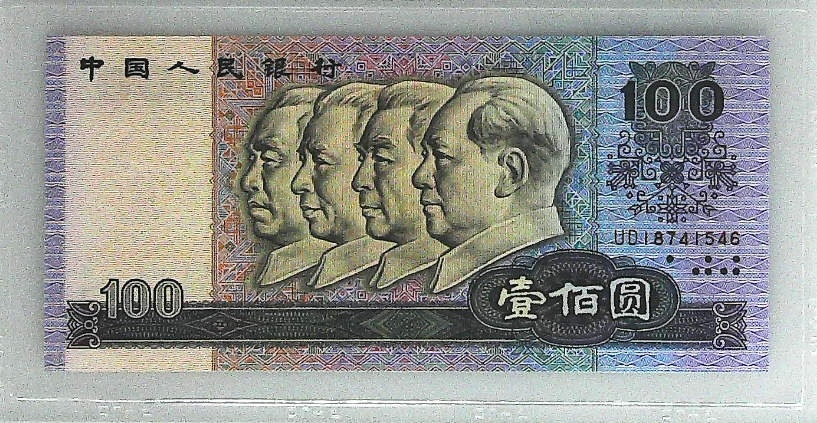

经过缩放处理可以得到<br>
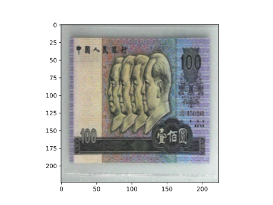

### 裁剪
##### transforms.CenterCrop
```python
torchvision.transforms.CenterCrop(size)
# 从图像中心裁剪图片
```
* size是所需裁剪的图片尺寸

`transforms.CenterCrop(196)`效果如下<br>
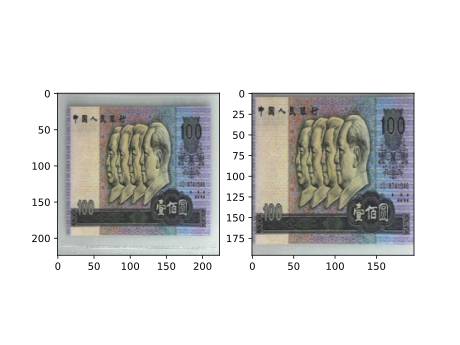

如果大小不够就会通过zero padding的方式填充图片，`transforms.CenterCrop(512)`效果如下<br>
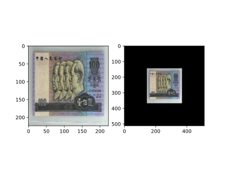

##### transforms.RandomCrop
```python
torchvision.transforms.RandomCrop(size, padding=None, pad_if_needed=False, fill=0, padding_mode='constant')
# 从图片中随机裁剪大小为size的图片，如果有padding就先padding再裁剪
```
- size: 裁剪大小
- padding: 设置填充大小
	- 当为 a 时，上下左右均填充 a 个像素
	- 当为 (a, b) 时，左右填充 a 个像素，上下填充 b 个像素
	- 当为 (a, b, c, d) 时，左上右下分别填充 a，b，c，d 个像素
- pad_if_need: 当图片小于设置的 size，是否填充
- padding_mode:
	- constant: 像素值由 fill 设定
	- edge: 像素值由图像边缘像素设定
	- reflect: 镜像填充，最后一个像素不镜像。(\[1,2,3,4] -> \[3,2,1,2,3,4,3,2])
	- symmetric: 镜像填充，最后一个像素也镜像。(\[1,2,3,4] -> \[2,1,1,2,3,4,4,4,3])
- fill: 当 padding_mode 为 constant 时，设置填充的像素值

下面是几种不同参数导致的不同结果图片
1. `transforms.RandomCrop(224, padding=16)`<br> 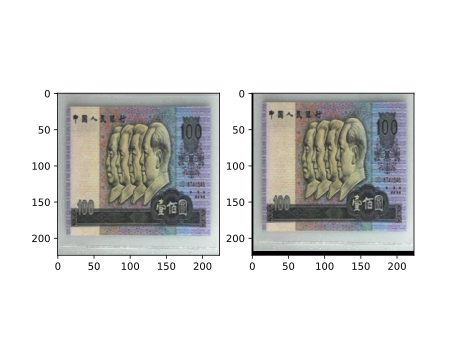
2. `transforms.RandomCrop(224, padding=(16, 64))`<br> 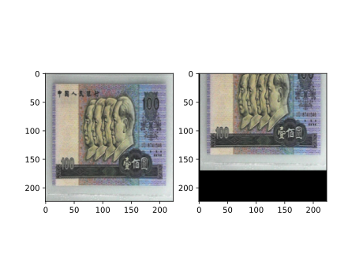
3. `transforms.RandomCrop(224, padding=16, fill=(255, 0, 0))`<br> 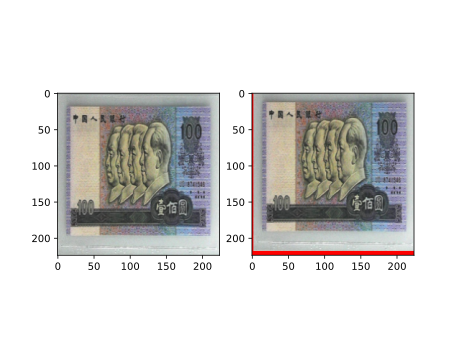
4. `transforms.RandomCrop(512, pad_if_needed=True)`<br> 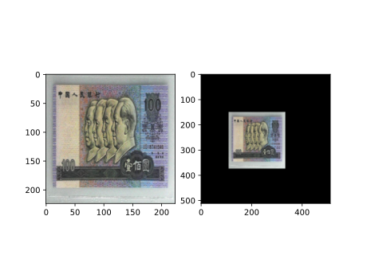
5. `transforms.RandomCrop(224, padding=64, padding_mode='edge')`<br> 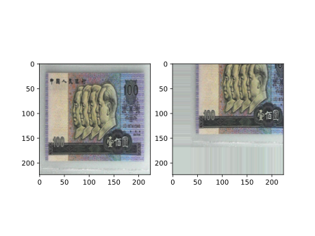
6. `transforms.RandomCrop(224, padding=64, padding_mode='reflect')`<br> 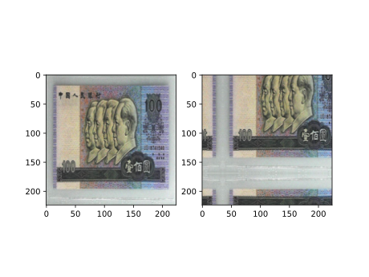
7. `transforms.RandomCrop(1024, padding=1024, padding_mode='symmetric')`<br> 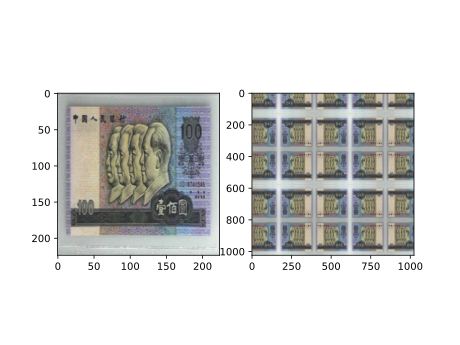

##### transforms.RandomResizedCrop
```python
torchvision.transforms.RandomResizedCrop(size, scale=(0.08, 1.0), ratio=(0.75, 1.3333333333333333), interpolation=2)
# 随机大小，随机宽高比裁剪图片，根据scale的比例裁剪原图，根据raito的长宽比再裁剪，最后使用插值法将图片变换为size大小
```
- size: 裁剪的图片尺寸
- scale: 随机缩放面积比例，默认随机选取 (0.08, 1) 之间的一个数
- ratio: 随机长宽比，默认随机选取 ($\frac{3}{4}$, $\frac{4}{3}$) 之间的一个数。因为超过这个比例会有明显的失真
- interpolation: 当裁剪出来的图片小于 size 时，就要使用插值方法 resize
	- PIL.Image.NEAREST
	- PIL.Image.BILINEAR
	- PIL.Image.BICUBIC

以下是两种结果示例
* `transforms.RandomResizedCrop(size=224, scale=(0.08, 1))`(缩放比随机)<br>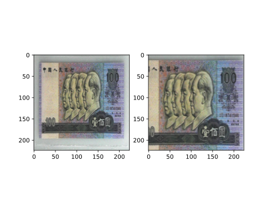
* `transforms.RandomResizedCrop(size=224, scale=(0.5, 0.5))`(缩放比固定0.5)<br> 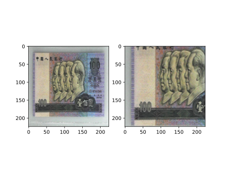

##### transforms.FiveCrop/TenCrop
```python
torchvision.transforms.FiveCrop(size)
torchvision.transforms.TenCrop(size, vertical_flip=False)
# FiveCrops是在图片的上下左右和中间截出大小为size的5张图片
# TenCrop是对这5张图片进行水平/垂直镜像获得10张图片，5张图片的区域不变
```
- size: 最后裁剪的图片尺寸
- vertical_flip: 是否垂直翻转

这两个方法返回的是tuple，所以需要将这些数据转换为tensor，经过处理之后可以获得如下图片<br>
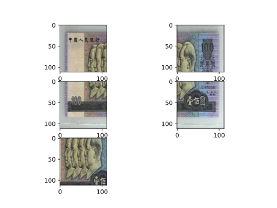

下面的图是通过`TenCrop`操作得到的<br>
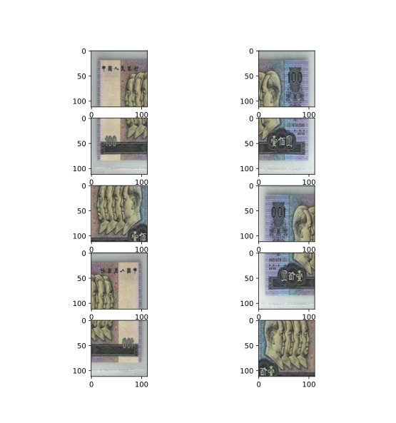

### 旋转和翻转
##### transforms.RandomHorizontalFlip/RandomVerticalFlip
根据概率，在水平或者垂直方向翻转图片

* `transforms.RandomHorizontalFlip(p=0.5)`，那么一半的图片会被水平翻转。
* `transforms.RandomHorizontalFlip(p=1)`，那么所有图片会被水平翻转。

* `transforms.RandomHorizontalFlip(p=1)`，水平翻转的效果如下<br> 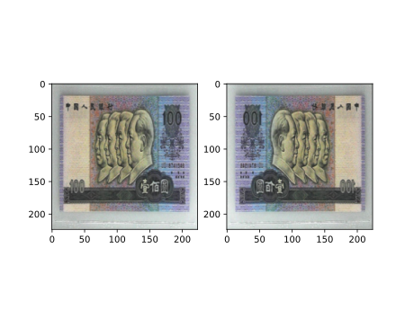
* `transforms.RandomVerticalFlip(p=1)`，垂直翻转的效果如下<br> 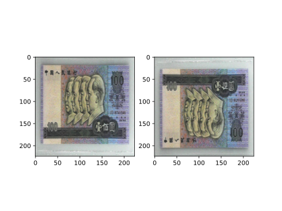

##### transforms.RandomRotation
```python
torchvision.transforms.RandomRotation(degrees, resample=False, expand=False, center=None, fill=None)
# 随机旋转图片
```
- degrees: 旋转角度
	- 当为 a 时，在 (-a, a) 之间随机选择旋转角度
	- 当为 (a, b) 时，在 (a, b) 之间随机选择旋转角度
- resample: 重采样方法
- expand: 是否扩大矩形框，以保持原图信息。根据中心旋转点计算扩大后的图片。**如果旋转点不是中心**，即使设置 expand = True，还是会有**部分信息丢失**。
- center: 旋转点设置，是坐标，默认中心旋转。如设置左上角为：(0, 0)

* `transforms.RandomRotation(90)`的效果如下<br> 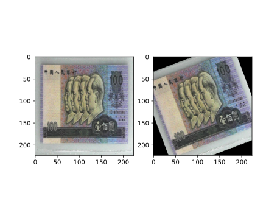
* `transforms.RandomRotation((90), expand=True)`的效果如下<br>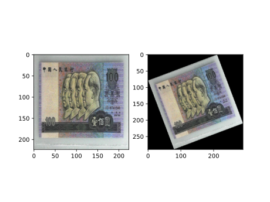<br>需要注意如果设置`expand = True`，那么一个batch中的所有图片的shape都会发生变化，会throw error，所以需要进行`resize`操作
* `transforms.RandomRotation(30, center=(0, 0))`的效果如下，设置旋转点为左上角<br>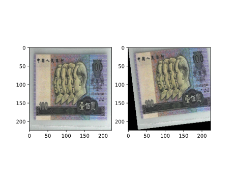
* `transforms.RandomRotation(30, center=(0, 0), expand=True)`的效果如下，如果旋转点不为中心，那么即使expand也会丢失信息<br> 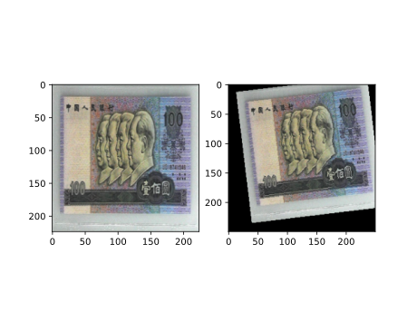

### 图像变换
##### Pad
```python
torchvision.transforms.Pad(padding, fill=0, padding_mode='constant')
# 对图像边缘进行填充
```
- padding: 设置填充大小
	- 当为 a 时，上下左右均填充 a 个像素
	- 当为 (a, b) 时，左右填充 a 个像素，上下填充 b 个像素
	- 当为 (a, b, c, d) 时，左上右下分别填充 a，b，c，d
- padding_mode: 填充模式，有 4 种模式，constant、edge、reflect、symmetric
- fill: 当 padding_mode 为 constant 时，设置填充的像素值，(R, G, B) 或者 (Gray)

* `transforms.Pad(padding=32, fill=(255, 0, 0), padding_mode='constant')`的效果如下<br>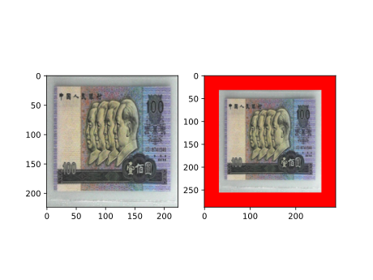
* `transforms.Pad(padding=(8, 64), fill=(255, 0, 0), padding_mode='constant')`的效果如下<br>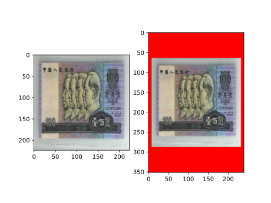
* `transforms.Pad(padding=(8, 16, 32, 64), fill=(255, 0, 0), padding_mode='constant')`的效果如下<br>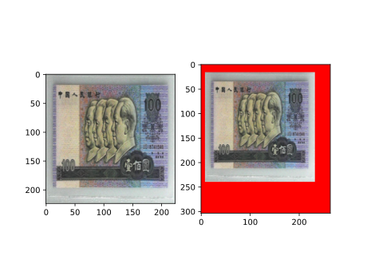
* `transforms.Pad(padding=(8, 16, 32, 64), fill=(255, 0, 0), padding_mode='symmetric')`的效果如下<br>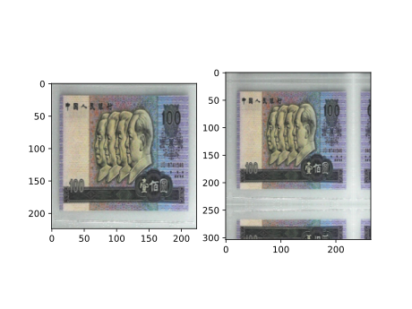

##### torchvision.transforms.ColorJitter
```python
torchvision.transforms.ColorJitter(brightness=0, contrast=0, saturation=0, hue=0)
# 调整亮度，对比度，饱和度，色相
```
- brightness: 亮度调整因子  
- contrast: 对比度参数  
- saturation: 饱和度参数  
	- brightness、contrast、saturation 参数：当为 a 时，从 \[max(0, 1-a), 1+a] 中随机选择；当为 (a, b) 时，从\[a, b] 中选择。  
- hue: 色相参数  
	- 当为 a 时，从\[-a, a] 中选择参数。其中$0≤a≤0.5$。
	- 当为 (a, b) 时，从 \[a, b] 中选择参数。其中$0≤a≤b≤0.5$。

效果不明显就不贴图了

##### transforms.Greyscale/RandomGreyscale
```python
torchvision.transforms.Grayscale(num_output_channels=1)
# 将图片转换为灰度图
```
* num_output_channels: 输出的通道数。**只能设置为 1 或者 3** (如果在后面使用了`transforms.Normalize`，则要设置为 3，因为`transforms.Normalize`只能接收 3 通道的输入)
```python
torchvision.transforms.RandomGrayscale(p=0.1, num_output_channels=1)
# 根据一定的概率转换为灰度图
```
- p: 概率值，图像被转换为灰度图的概率
- num_output_channels: 输出的通道数。只能设置为 1 或者 3

`transforms.Grayscale(num_output_channels=3)`的效果如下<br>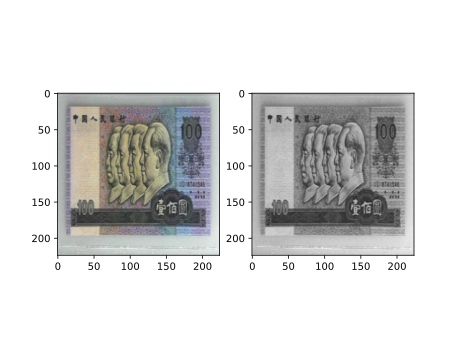

##### transforms.RandomAffine
```python
torchvision.transforms.RandomAffine(degrees, translate=None, scale=None, shear=None, resample=False, fillcolor=0)
# 对图像进行仿射变换，二维的线性变换。存在旋转、平移、缩放、错切和翻转
```
- degree: 旋转角度设置
- translate: 平移区间设置，如 `(a, b)`，a 设置宽 (`width`)，b 设置高 (`height`)。图像在宽维度平移的区间为 $− img\_width\times a < dx < img\_width \times a$，高同理
- scale: 缩放比例，以面积为单位
- fillcolor: 填充颜色设置
- shear: 错切角度设置，有水平错切和垂直错切
	- 若为 a，则仅在 x 轴错切，在 (-a, a) 之间随机选择错切角度
	- 若为 (a, b)，x 轴在 (-a, a) 之间随机选择错切角度，y 轴在 (-b, b) 之间随机选择错切角度
	- 若为 (a, b, c, d)，x 轴在 (a, b) 之间随机选择错切角度，y 轴在 (c, d) 之间随机选择错切角度
- resample: 重采样方式，有 NEAREST、BILINEAR、BICUBIC

* `transforms.RandomAffine(degrees=30)`的效果如下<br>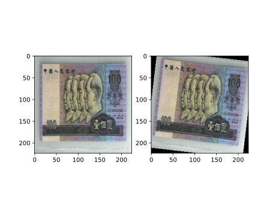
* `transforms.RandomAffine(degrees=0, translate=(0.2, 0.2), fill=(255, 0, 0))`的效果如下<br>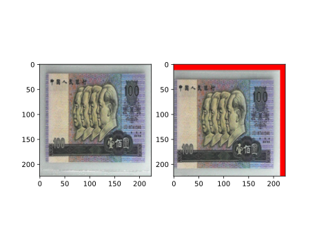
* `transforms.RandomAffine(degrees=0, scale=(0.7, 0.7))`的效果如下<br>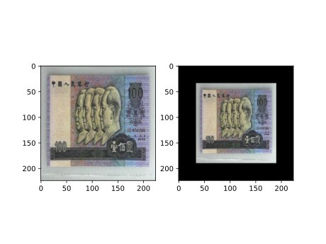
* `transforms.RandomAffine(degrees=0, shear=(0, 0, 0, 45))`的效果如下<br>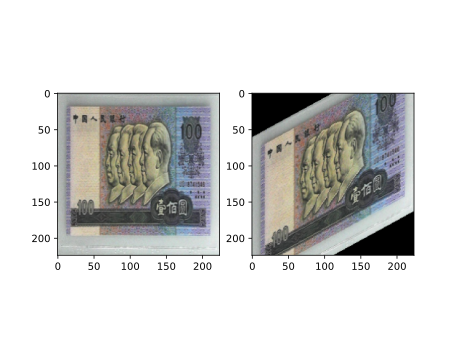
* `transforms.RandomAffine(degrees=0, shear=90, fill=(255, 0, 0))`的效果如下<br>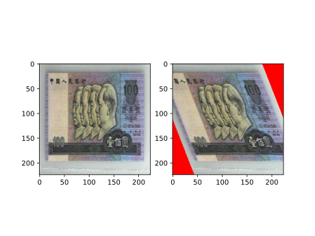

##### transforms.RandomErasing
```python
torchvision.transforms.RandomErasing(p=0.5, scale=(0.02, 0.33), ratio=(0.3, 3.3), value=0, inplace=False)
# 对图像进行随机遮挡，输入是tensor，所以需要先进行ToTensor操作
```
- p: 概率值，执行该操作的概率
- scale: 遮挡区域的面积。如(a, b)，则会随机选择 (a, b) 中的一个遮挡比例
- ratio: 遮挡区域长宽比。如(a, b)，则会随机选择 (a, b) 中的一个长宽比
- value: 设置遮挡区域的像素值。(R, G, B) 或者 Gray，或者字符串`"random"`。由于之前执行了`transforms.ToTensor()`，像素值归一化到了 0~1 之间，因此这里设置的 (R, G, B) 要除以 255

* `transforms.RandomErasing(p=1, scale=(0.02, 0.33), ratio=(0.3, 3.3), value=(254/255, 0, 0))`的效果如下<br>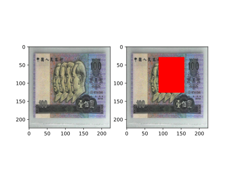
* `transforms.RandomErasing(p=1, scale=(0.02, 0.33), ratio=(0.3, 3.3), value='random')`的效果如下<br>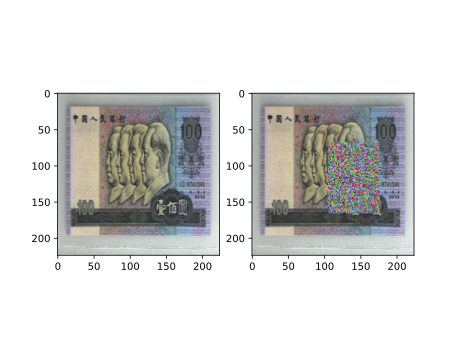

##### transforms.Lambda
自定义transform方法，详细可以另外深入学习

### transforms的操作
##### torchvision.transforms.RandomChioce
```python
torchvision.transforms.RandomChoice([transforms1, transforms2, transforms3])
# 从一系列中选择一个
```

##### transforms.RandomApply
```python
torchvision.transforms.RandomApply([transforms1, transforms2, transforms3], p=0.5)
# 依据概率执行一系列操作，要么全部执行，要么全部不执行
```

##### transforms.RandomOrder
```python
transforms.RandomOrder([transforms1, transforms2, transforms3])
# 对一组transforms操作打乱顺序
```

### 自定义transforms
除开上面那些本身自带的transforms，用户也可以自定义特殊的transforms效果，比如增加**椒盐噪声**

自定义transforms需要注意两个点
* 仅接收一个参数，返回一个参数
* 上一个transform的输出就是下一个transform的输入

下面是自定义椒盐噪声的代码示例(`__call__()`就是核心操作)
```python
import numpy as np
import random
from PIL import Image

# 自定义添加椒盐噪声的 transform
class AddPepperNoise(object):
    """增加椒盐噪声
    Args:
        snr （float）: Signal Noise Rate
        p (float): 概率值，依概率执行该操作
    """

    def __init__(self, snr, p=0.9):
        assert isinstance(snr, float) or (isinstance(p, float))
        self.snr = snr
        self.p = p

    # transform 会调用该方法
    def __call__(self, img):
        """
        Args:
            img (PIL Image): PIL Image
        Returns:
            PIL Image: PIL image.
        """
        # 如果随机概率小于 seld.p，则执行 transform
        if random.uniform(0, 1) < self.p:
            # 把 image 转为 array
            img_ = np.array(img).copy()
            # 获得 shape
            h, w, c = img_.shape
            # 信噪比
            signal_pct = self.snr
            # 椒盐噪声的比例 = 1 -信噪比
            noise_pct = (1 - self.snr)
            # 选择的值为 (0, 1, 2)，每个取值的概率分别为 [signal_pct, noise_pct/2., noise_pct/2.]
            # 椒噪声和盐噪声分别占 noise_pct 的一半
            # 1 为盐噪声，2 为 椒噪声
            mask = np.random.choice((0, 1, 2), size=(h, w, 1), p=[signal_pct, noise_pct/2., noise_pct/2.])
            mask = np.repeat(mask, c, axis=2)
            img_[mask == 1] = 255   # 盐噪声
            img_[mask == 2] = 0     # 椒噪声
            # 再转换为 image
            return Image.fromarray(img_.astype('uint8')).convert('RGB')
        # 如果随机概率大于 seld.p，则直接返回原图
        else:
            return img
```

下面是自定义transform的效果<br>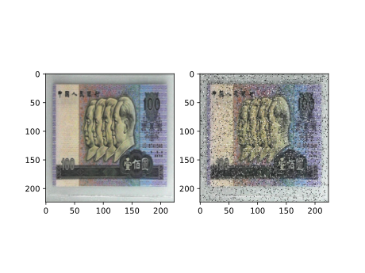

下面是完整的测试用代码
```python
# -*- coding: utf-8 -*-

import os
import numpy as np
import torch
import random
import math
import torchvision.transforms as transforms
from PIL import Image
from matplotlib import pyplot as plt
from enviroments import rmb_split_dir
from lesson2.transforms.addPepperNoise import AddPepperNoise
def set_seed(seed=1):
    random.seed(seed)
    np.random.seed(seed)
    torch.manual_seed(seed)
    torch.cuda.manual_seed(seed)

set_seed(1)  # 设置随机种子

# 参数设置
MAX_EPOCH = 10
BATCH_SIZE = 1
LR = 0.01
log_interval = 10
val_interval = 1
rmb_label = {"1": 0, "100": 1}

#对 tensor 进行反标准化操作，并且把 tensor 转换为 image，方便可视化。
def transform_invert(img_, transform_train):
    """
    将data 进行反transfrom操作
    :param img_: tensor
    :param transform_train: torchvision.transforms
    :return: PIL image
    """

    # 如果有标准化操作
    if 'Normalize' in str(transform_train):
        # 取出标准化的 transform
        norm_transform = list(filter(lambda x: isinstance(x, transforms.Normalize), transform_train.transforms))
        # 取出均值
        mean = torch.tensor(norm_transform[0].mean, dtype=img_.dtype, device=img_.device)
        # 取出标准差
        std = torch.tensor(norm_transform[0].std, dtype=img_.dtype, device=img_.device)
        # 乘以标准差，加上均值
        img_.mul_(std[:, None, None]).add_(mean[:, None, None])

    # 把 C*H*W 变为 H*W*C
    img_ = img_.transpose(0, 2).transpose(0, 1)  # C*H*W --> H*W*C
    # 把 0~1 的值变为 0~255
    img_ = np.array(img_) * 255

    # 如果是 RGB 图
    if img_.shape[2] == 3:
        img_ = Image.fromarray(img_.astype('uint8')).convert('RGB')
        # 如果是灰度图
    elif img_.shape[2] == 1:
        img_ = Image.fromarray(img_.astype('uint8').squeeze())
    else:
        raise Exception("Invalid img shape, expected 1 or 3 in axis 2, but got {}!".format(img_.shape[2]) )

    return img_


norm_mean = [0.485, 0.456, 0.406]
norm_std = [0.229, 0.224, 0.225]

train_transform = transforms.Compose([
    # 缩放到 (224, 224) 大小，会拉伸
    transforms.Resize((224, 224)),

    # 1 CenterCrop 中心裁剪
    # transforms.CenterCrop(512),     # 512
    # transforms.CenterCrop(196),     # 512

    # 2 RandomCrop
    # transforms.RandomCrop(224, padding=16),
    # transforms.RandomCrop(224, padding=(16, 64)),
    # transforms.RandomCrop(224, padding=16, fill=(255, 0, 0)),
    # transforms.RandomCrop(512, pad_if_needed=True),   # pad_if_needed=True
    # transforms.RandomCrop(224, padding=64, padding_mode='edge'),
    # transforms.RandomCrop(224, padding=64, padding_mode='reflect'),
    # transforms.RandomCrop(1024, padding=1024, padding_mode='symmetric'),

    # 3 RandomResizedCrop
    # transforms.RandomResizedCrop(size=224, scale=(0.08, 1)),
    # transforms.RandomResizedCrop(size=224, scale=(0.5, 0.5)),

    # 4 FiveCrop
    # transforms.FiveCrop(112),
    # 返回的是 tuple，因此需要转换为 tensor
    # transforms.Lambda(lambda crops: torch.stack([(transforms.ToTensor()(crop)) for crop in crops])),

    # 5 TenCrop
    # transforms.TenCrop(112, vertical_flip=False),
    # transforms.Lambda(lambda crops: torch.stack([(transforms.ToTensor()(crop)) for crop in crops])),

    # 1 Horizontal Flip
    # transforms.RandomHorizontalFlip(p=1),

    # 2 Vertical Flip
    # transforms.RandomVerticalFlip(p=1),

    # 3 RandomRotation
    # transforms.RandomRotation(90),
    # transforms.RandomRotation((90), expand=True),
    # transforms.RandomRotation(30, center=(0, 0)),
    # transforms.RandomRotation(30, center=(0, 0), expand=True),   # expand only for center rotation


    # 1 Pad
    # transforms.Pad(padding=32, fill=(255, 0, 0), padding_mode='constant'),
    # transforms.Pad(padding=(8, 64), fill=(255, 0, 0), padding_mode='constant'),
    # transforms.Pad(padding=(8, 16, 32, 64), fill=(255, 0, 0), padding_mode='constant'),
    # transforms.Pad(padding=(8, 16, 32, 64), fill=(255, 0, 0), padding_mode='symmetric'),

    # 2 ColorJitter
    # transforms.ColorJitter(brightness=0.5),
    # transforms.ColorJitter(contrast=0.5),
    # transforms.ColorJitter(saturation=0.5),
    # transforms.ColorJitter(hue=0.3),

    # 3 Grayscale
    # transforms.Grayscale(num_output_channels=3),

    # 4 Affine
    # transforms.RandomAffine(degrees=30),
    # transforms.RandomAffine(degrees=0, translate=(0.2, 0.2), fillcolor=(255, 0, 0)),
    # transforms.RandomAffine(degrees=0, scale=(0.7, 0.7)),
    # transforms.RandomAffine(degrees=0, shear=(0, 0, 0, 45)),
    # transforms.RandomAffine(degrees=0, shear=90, fillcolor=(255, 0, 0)),

    # 5 Erasing
    # transforms.ToTensor(),
    # transforms.RandomErasing(p=1, scale=(0.02, 0.33), ratio=(0.3, 3.3), value=(254/255, 0, 0)),
    # transforms.RandomErasing(p=1, scale=(0.02, 0.33), ratio=(0.3, 3.3), value='fads43'),

    # 1 RandomChoice
    # transforms.RandomChoice([transforms.RandomVerticalFlip(p=1), transforms.RandomHorizontalFlip(p=1)]),

    # 2 RandomApply
    # transforms.RandomApply([transforms.RandomAffine(degrees=0, shear=45, fillcolor=(255, 0, 0)),
    #                         transforms.Grayscale(num_output_channels=3)], p=0.5),
    # 3 RandomOrder
    # transforms.RandomOrder([transforms.RandomRotation(15),
    #                         transforms.Pad(padding=32),
    #                         transforms.RandomAffine(degrees=0, translate=(0.01, 0.1), scale=(0.9, 1.1))]),

    AddPepperNoise(0.9, p=0.5),
    transforms.ToTensor(),
    transforms.Normalize(norm_mean, norm_std),
])

path_img=os.path.join(rmb_split_dir, "train", "100","0A4DSPGE.jpg")
img = Image.open(path_img).convert('RGB')  # 0~255
img=transforms.Resize((224, 224))(img)
img_tensor = train_transform(img)


## 展示单张图片
# 这里把转换后的 tensor 再转换为图片
convert_img=transform_invert(img_tensor, train_transform)
plt.subplot(1, 2, 1)
plt.imshow(img)
plt.subplot(1, 2, 2)
plt.imshow(convert_img)
plt.show()
plt.pause(0.5)
plt.close()


## 展示 FiveCrop 和 TenCrop 的图片
# ncrops, c, h, w = img_tensor.shape
# columns=2 # 两列
# rows= math.ceil(ncrops/2) # 计算多少行
# # 把每个 tensor ([c,h,w]) 转换为 image
# for i in range(ncrops):
#     img = transform_invert(img_tensor[i], train_transform)
#     plt.subplot(rows, columns, i+1)
#     plt.imshow(img)
# plt.show()
```

### 数据增强实战应用
数据增强的原则是需要我们观察**训练集和测试集之间的差异**，然后应用有效的数增强，使得训练集和测试集更加接近

比方说如果对象颜色不一样，可能需要做色彩增强；如果对象形态不一，可能需要做仿射变换；如果对象位置不同，可能需要做平移操作

比方说第四套一元纸币和一百元纸币不好应用到第五套人民币上，但是如果使用灰度变换，就能**减少颜色带来的偏差**<br>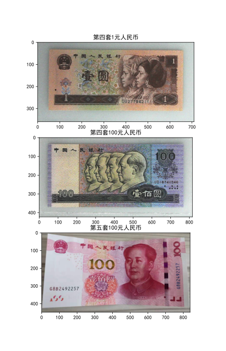


