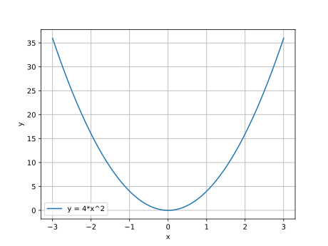
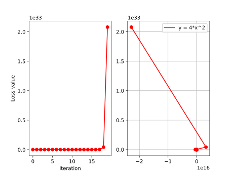
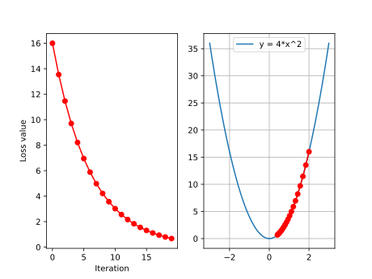
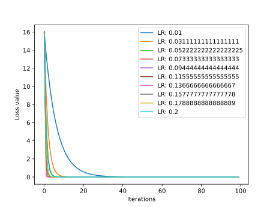
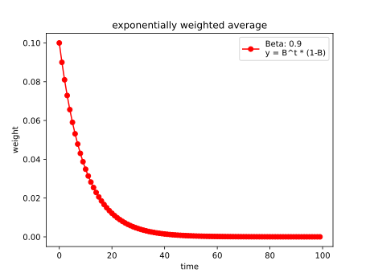
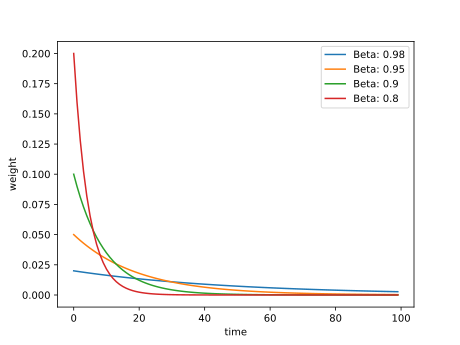
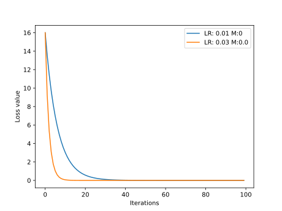
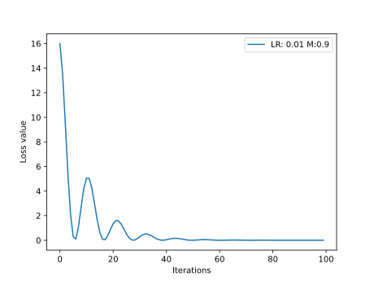
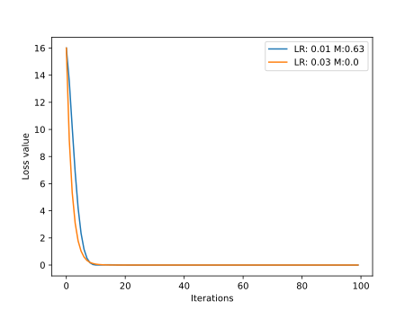

### 什么是优化器
PyTorch 中的优化器是用于管理并更新模型中可学习参数的值，使得模型输出更加接近真实标签

### optimizer的属性
```python
class Optimizer(object):
	def __init__(self, params, defaults):
		self.defaults = defaults
        self.state = defaultdict(dict)
        self.param_groups = []
```
- `defaults`：优化器的超参数，如 weight_decay，momentum
- `state`：参数的缓存，如 momentum 中需要用到前几次的梯度，就缓存在这个变量中
- `param_groups`：管理的参数组，是一个 list，其中每个元素是字典，包括 momentum、lr、weight_decay、params 等。
- `_step_count`：记录更新 次数，在学习率调整中使用

### optimizer的方法
* `zero_grad()`
```python
# 这是旧版，新版可以自行查看
def zero_grad(self):  
r"""Clears the gradients of all optimized :class:`torch.Tensor` s."""  
	for group in self.param_groups:  
		for p in group['params']:  
			if p.grad is not None:  
				p.grad.detach_()  
				p.grad.zero_()
```
* `step()`
* `add_param_group()`
```python
def add_param_group(self, param_group):  
	params = param_group['params']  
	if isinstance(params, torch.Tensor):  
		param_group['params'] = [params]  
	...  
	self.param_groups.append(param_group)
```
* `state_dict()`
* `load_state_dict()`
```python
def state_dict(self):  
r"""Returns the state of the optimizer as a :class:`dict`. """ 
...  
return {  
'state': packed_state,  
'param_groups': param_groups,  
}
```

#### step()
张量weight的形状是$2\times 2$，设置梯度为$1$，将学习率设置为1，这样就是将所有的张量减去1，代码示例如下
```python
weight = torch.randn((2, 2), requires_grad=True)
weight.grad = torch.ones((2, 2))

optimizer = optim.SGD([weight], lr=1)
print("weight before step:{}".format(weight.data))
optimizer.step()        # 修改lr=1, 0.1观察结果
print("weight after step:{}".format(weight.data))
```

输出如下
```text
weight before step:tensor([[0.6614, 0.2669],
        [0.0617, 0.6213]])
weight after step:tensor([[-0.3386, -0.7331],
        [-0.9383, -0.3787]])
```

#### zero_grad()
代码示例
```python
print("weight before step:{}".format(weight.data))
optimizer.step()        # 修改lr=1 0.1观察结果
print("weight after step:{}".format(weight.data))

print("weight in optimizer:{}\nweight in weight:{}\n".format(id(optimizer.param_groups[0]['params'][0]), id(weight)))

print("weight.grad is {}\n".format(weight.grad))
optimizer.zero_grad()
print("after optimizer.zero_grad(), weight.grad is\n{}".format(weight.grad))
```

输出如下
```text
weight before step:tensor([[0.6614, 0.2669],
        [0.0617, 0.6213]])
weight after step:tensor([[-0.3386, -0.7331],
        [-0.9383, -0.3787]])
weight in optimizer:1791532846368
weight in weight:1791532846368

weight.grad is tensor([[1., 1.],
        [1., 1.]])

after optimizer.zero_grad(), weight.grad is
None
```

#### add_param_group()
代码示例
```python
print("optimizer.param_groups is\n{}".format(optimizer.param_groups))
w2 = torch.randn((3, 3), requires_grad=True)
optimizer.add_param_group({"params": w2, 'lr': 0.0001})
print("optimizer.param_groups is\n{}".format(optimizer.param_groups))
```

```text
optimizer.param_groups is
[{'params': [tensor([[0.6614, 0.2669],
        [0.0617, 0.6213]], requires_grad=True)], 'lr': 1, 'momentum': 0, 'dampening': 0, 'weight_decay': 0, 'nesterov': False, 'maximize': False, 'foreach': None, 'differentiable': False, 'fused': None}]
optimizer.param_groups is
[{'params': [tensor([[0.6614, 0.2669],
        [0.0617, 0.6213]], requires_grad=True)], 'lr': 1, 'momentum': 0, 'dampening': 0, 'weight_decay': 0, 'nesterov': False, 'maximize': False, 'foreach': None, 'differentiable': False, 'fused': None}, {'params': [tensor([[-0.4519, -0.1661, -1.5228],
        [ 0.3817, -1.0276, -0.5631],
        [-0.8923, -0.0583, -0.1955]], requires_grad=True)], 'lr': 0.0001, 'momentum': 0, 'dampening': 0, 'weight_decay': 0, 'nesterov': False, 'maximize': False, 'foreach': None, 'differentiable': False, 'fused': None}]
```

#### state_dict()
首先进行10次反向传播更新，然后对比`state_dict`的变化，可以用`torch.save()`把`state_dict`保存到 pkl 文件中

代码示例
```python
optimizer = optim.SGD([weight], lr=0.1, momentum=0.9)
opt_state_dict = optimizer.state_dict()

print("state_dict before step:\n", opt_state_dict)

for i in range(10):
optimizer.step()

print("state_dict after step:\n", optimizer.state_dict())

torch.save(optimizer.state_dict(), os.path.join(BASE_DIR, "optimizer_state_dict.pkl"))
```

输出如下
```text
state_dict before step:
 {'state': {}, 'param_groups': [{'lr': 0.1, 'momentum': 0.9, 'dampening': 0, 'weight_decay': 0, 'nesterov': False, 'maximize': False, 'foreach': None, 'differentiable': False, 'fused': None, 'params': [0]}]}
state_dict after step:
 {'state': {0: {'momentum_buffer': tensor([[6.5132, 6.5132],
        [6.5132, 6.5132]])}}, 'param_groups': [{'lr': 0.1, 'momentum': 0.9, 'dampening': 0, 'weight_decay': 0, 'nesterov': False, 'maximize': False, 'foreach': None, 'differentiable': False, 'fused': None, 'params': [0]}]}
```

#### load_state_dict()
可以先通过`torch.load()`读入内存，然后利用`load_state_dict()`加载到模型，继续训练

代码示例
```python
optimizer = optim.SGD([weight], lr=0.1, momentum=0.9)
state_dict = torch.load(os.path.join(BASE_DIR, "optimizer_state_dict.pkl"))

print("state_dict before load state:\n", optimizer.state_dict())
optimizer.load_state_dict(state_dict)
print("state_dict after load state:\n", optimizer.state_dict())
```

输出如下
```text
state_dict before load state:
 {'state': {}, 'param_groups': [{'lr': 0.1, 'momentum': 0.9, 'dampening': 0, 'weight_decay': 0, 'nesterov': False, 'maximize': False, 'foreach': None, 'differentiable': False, 'fused': None, 'params': [0]}]}
state_dict after load state:
 {'state': {0: {'momentum_buffer': tensor([[6.5132, 6.5132],
        [6.5132, 6.5132]])}}, 'param_groups': [{'lr': 0.1, 'momentum': 0.9, 'dampening': 0, 'weight_decay': 0, 'nesterov': False, 'maximize': False, 'foreach': None, 'differentiable': False, 'fused': None, 'params': [0]}]}
```

### 学习率
学习率是影响损失函数收敛的重要因素，控制了梯度下降更新的步伐

设置一个损失函数$y=(2x)^2$，令$x$的初始值为2，学习率为1<br>

示例代码如下
```python
iter_rec, loss_rec, x_rec = list(), list(), list()

lr = 0.01    # /1. /.5 /.2 /.1 /.125
max_iteration = 20   # /1. 4     /.5 4   /.2 20 200

for i in range(max_iteration):

y = func(x)
y.backward()

print("Iter:{}, X:{:8}, X.grad:{:8}, loss:{:10}".format(
i, x.detach().numpy()[0], x.grad.detach().numpy()[0], y.item()))

x_rec.append(x.item())

x.data.sub_(lr * x.grad)    # x -= x.grad  数学表达式意义:  x = x - x.grad    # 0.5 0.2 0.1 0.125
x.grad.zero_()

iter_rec.append(i)
loss_rec.append(y.detach().numpy())

plt.subplot(121).plot(iter_rec, loss_rec, '-ro')
plt.xlabel("Iteration")
plt.ylabel("Loss value")

x_t = torch.linspace(-3, 3, 100)
y = func(x_t)
plt.subplot(122).plot(x_t.numpy(), y.numpy(), label="y = 4*x^2")
plt.grid()
y_rec = [func(torch.tensor(i)).item() for i in x_rec]
plt.subplot(122).plot(x_rec, y_rec, '-ro')
plt.legend()
plt.show()
```

结果图如下<br><br>可以发现损失函数不仅没有减少反而增大了，学习率太大导致的无法收敛，所以调整学习率为0.01，结果如下<br><br>所以通过调整学习率能让模型更快收敛

下面的代码测试了10组不同的学习率，对比不同的收敛情况
```python
    iteration = 100
    num_lr = 10
    lr_min, lr_max = 0.01, 0.2  # .5 .3 .2

    lr_list = np.linspace(lr_min, lr_max, num=num_lr).tolist()
    loss_rec = [[] for l in range(len(lr_list))]
    iter_rec = list()

    for i, lr in enumerate(lr_list):
        x = torch.tensor([2.], requires_grad=True)
        for iter in range(iteration):

            y = func(x)
            y.backward()
            x.data.sub_(lr * x.grad)  # x.data -= x.grad
            x.grad.zero_()

            loss_rec[i].append(y.item())

    for i, loss_r in enumerate(loss_rec):
        plt.plot(range(len(loss_r)), loss_r, label="LR: {}".format(lr_list[i]))
    plt.legend()
    plt.xlabel('Iterations')
    plt.ylabel('Loss value')
    plt.show()
```

结果如下<br><br>观察图片可知这个模型学习率下降最快在0.13左右，由于无法事先得知最佳学习率，所以按照经验设置为比较小的数即可

### momentum 动量
动量除去考虑当前的梯度之外，还会考虑之前的梯度

其来源于**指数加权平均**$$v_t=\beta*v_{t-1}+(1-\beta)*\theta_t$$
* $v_t$和$v_{t-1}$指现在和上一个时刻的指数加权平均
* $\theta_t$指当前时刻的值
* $\beta$一般是一个小于1的系数

通过展开推导式，就可以得出下面的式子$$v_N=\sum_{i=0}^N(1-\beta)*\beta^i*\theta_{N-i}$$

通过推导式可以知道，因为$\beta<1$，所以越前面的$\theta$对后面的影响越小，可以理解为**记忆周期**

下面是$\beta=0.9$的一个代码示例
```python
weights = exp_w_func(beta, time_list)

    plt.plot(time_list, weights, '-ro', label="Beta: {}\ny = B^t * (1-B)".format(beta))
    plt.xlabel("time")
    plt.ylabel("weight")
    plt.legend()
    plt.title("exponentially weighted average")
    plt.show()

    print(np.sum(weights))
```

结果如下<br>

下面代码是不同$\beta$取值情况的测试代码
```python
    beta_list = [0.98, 0.95, 0.9, 0.8]
    w_list = [exp_w_func(beta, time_list) for beta in beta_list]
    for i, w in enumerate(w_list):
        plt.plot(time_list, w, label="Beta: {}".format(beta_list[i]))
        plt.xlabel("time")
        plt.ylabel("weight")
    plt.legend()
    plt.show()
```

结果图如下<br>
$\beta$的值越大，记忆周期越长，就会更平缓

在pytorch中，momentum的更新公式如下$$v_i=m*v_{i-1}+g(w_i), w_{i+1}=w_i-lr*v_i$$
其中$w_{i+1}$表示在$i+1$次更新的参数，$lr$是学习率，$v_i$是更新量，$m$表示动量系数，$g(w_i)$表示$w_i$的梯度

展开不难发现$$v_N=\sum_{i=0}^Nm^ig(w_{N-i})$$

首先先不适用动量，对上面提及的$y=(2x)^2$模型使用`lr=0.01`和`lr=0.03`进行测试，代码如下
```python
    def func(x):
        return torch.pow(2*x, 2)    # y = (2x)^2 = 4*x^2        dy/dx = 8x

    iteration = 100
    m = 0     # .9 .63

    lr_list = [0.01, 0.03]

    momentum_list = list()
    loss_rec = [[] for l in range(len(lr_list))]
    iter_rec = list()

    for i, lr in enumerate(lr_list):
        x = torch.tensor([2.], requires_grad=True)

        momentum = 0. if lr == 0.03 else m
        momentum_list.append(momentum)

        optimizer = optim.SGD([x], lr=lr, momentum=momentum)

        for iter in range(iteration):

            y = func(x)
            y.backward()

            optimizer.step()
            optimizer.zero_grad()

            loss_rec[i].append(y.item())

    for i, loss_r in enumerate(loss_rec):
        plt.plot(range(len(loss_r)), loss_r, label="LR: {} M:{}".format(lr_list[i], momentum_list[i]))
    plt.legend()
    plt.xlabel('Iterations')
    plt.ylabel('Loss value')
    plt.show()
```

得到如下结果<br>

现在，不使用0.03的学习率，同时将momentum设置为0.9结果如下<br>
可以发现结果出现**震荡收敛**的情况，这是因为momentum的数值太大，考虑比例太大，所以通过减小momentum大小可以有效处理，将momentum设置为0.63，得到结果如下<br>

可以发现设置适当的momentum，`lr=0.01`的情况收敛更快了一点

### PyTorch提供的十种优化器
#### optim.SGD
```python
optim.SGD(params, lr=<required parameter>, momentum=0, dampening=0, weight_decay=0, nesterov=False
```

随机梯度下降法

- `params`：管理的参数组
- `lr`：初始学习率
- `momentum`：动量系数 $\beta$
- `weight_decay`：L2 正则化系数
- `nesterov`：是否采用 NAG

#### optim.Adagrad
自适应学习率梯度下降法

#### optim.RMSprop
Adagrad 的改进

#### optim.Adadelta
#### optim.Adam
RMSProp 集合 Momentum，这个是目前最常用的优化器，因为它可以使用较大的初始学习率

#### optim.Adamax
Adam 增加学习率上限

#### optim.SparseAdam
稀疏版的 Adam

#### optim.ASGD
随机平均梯度下降

#### optim.Rprop
弹性反向传播，这种优化器通常是在所有样本都一起训练，也就是 batchsize 为全部样本时使用

#### optim.LBFGS
BFGS 在内存上的改进
