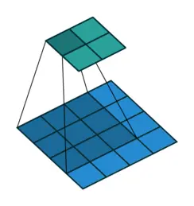

### 1D/2D/3D卷积
卷积存在多种维度的卷积，一般来说，filter在什么维度上滑动就是几维卷积
#### 一维卷积
<br>

#### 二维卷积
<br>

#### 三维卷积
<br>

### 二维卷积 nn.Conv2d()
```python
nn.Conv2d(self, in_channels, out_channels, kernel_size, stride=1,
                 padding=0, dilation=1, groups=1,
                 bias=True, padding_mode='zeros')
# 对多个二维信号进行二维卷积
```
- `in_channels`：输入通道数
- `out_channels`：输出通道数，等价于**卷积核个数**/[[../CNN/Convolutional Neural Network#^6d3e36|Reception Field]]个数
- `kernel_size`：卷积核尺寸
- `stride`：步长
- `padding`：填充宽度，主要是为了调整输出的特征图大小，一般把 padding 设置合适的值后，**保持输入和输出的图像尺寸**不变。
- `dilation`：空洞卷积大小，默认为 1，这时是标准卷积，常用于图像分割任务中，主要是为了提升感受野
- `groups`：分组卷积设置，主要是为了模型的轻量化，如在 ShuffleNet、MobileNet、SqueezeNet 中用到
- `bias`：偏置

#### 卷积尺寸计算
##### 简化版卷积尺寸计算
暂时不考虑**空洞卷积**，设输入图片大小为$I\times I$，卷积核的大小为$k\times k$，stride为$s$，padding的像素数为$p$，图片经过卷积之后的尺寸$O$可以表示为$$O=\frac{I-k+2\times p}{s}+1$$

例如下面的图片示例，输出的图片大小为$\frac{5-3+2\times 0}{1}+1=3$<br>


##### 完整卷积尺寸计算
在上面的基础上，增加了**空洞卷积**dilation为$d$，可以计算出尺寸$O$为$$O=\frac{I-d\times(k-1)+2\times p-1}{s}+1$$

卷积网络代码示例
```python
import os
import torch.nn as nn
from PIL import Image
from torchvision import transforms
from matplotlib import pyplot as plt
from common_tools import transform_invert, set_seed

set_seed(3)  # 设置随机种子

# ================================= load img ==================================
path_img = os.path.join(os.path.dirname(os.path.abspath(__file__)), "imgs", "lena.png")
print(path_img)
img = Image.open(path_img).convert('RGB')  # 0~255

# convert to tensor
img_transform = transforms.Compose([transforms.ToTensor()])
img_tensor = img_transform(img)
# 添加 batch 维度
img_tensor.unsqueeze_(dim=0)    # C*H*W to B*C*H*W

# ================================= create convolution layer ==================================

# ================ 2d
flag = 1
# flag = 0
if flag:
    conv_layer = nn.Conv2d(3, 1, 3)   # input:(i, o, size) weights:(o, i , h, w)
    # 初始化卷积层权值
    nn.init.xavier_normal_(conv_layer.weight.data)
 # nn.init.xavier_uniform_(conv_layer.weight.data)
    # calculation
    img_conv = conv_layer(img_tensor)

# ================ transposed
# flag = 1
flag = 0
if flag:
    conv_layer = nn.ConvTranspose2d(3, 1, 3, stride=2)   # input:(input_channel, output_channel, size)
    # 初始化网络层的权值
    nn.init.xavier_normal_(conv_layer.weight.data)

    # calculation
    img_conv = conv_layer(img_tensor)

# ================================= visualization ==================================
print("卷积前尺寸:{}\n卷积后尺寸:{}".format(img_tensor.shape, img_conv.shape))
img_conv = transform_invert(img_conv[0, 0:1, ...], img_transform)
img_raw = transform_invert(img_tensor.squeeze(), img_transform)
plt.subplot(122).imshow(img_conv, cmap='gray')
plt.subplot(121).imshow(img_raw)
plt.show()
```

卷积结果如下<br>

通过不同的方式初始化网络权值，会得到不同的卷积结果，如下图<br>

通过`conv_layer.weight.shape`查看卷积核的 shape 是`(1, 3, 3, 3)`，对应是`(output_channel, input_channel, kernel_size, kernel_size)`，第一个维度对应卷积核的个数。计算时，通过`input_channel`将卷积核分别对每通道进行卷积操作，并输出`output_channel`个数个通道的结果，通过**加和**和**增加bias**等操作后得到最终结果

### 转置卷积 nn.ConvTranspose()
转置卷积又称为反卷积 (Deconvolution) 和部分跨越卷积 (Fractionally strided Convolution)，用于对图像进行上采样

一般卷积如下图<br>
原始的图片尺寸为 $4\times4$，卷积核大小为$3\times 3$，$padding=0$，$stride=1$。由于卷积操作可以通过矩阵运算来解决，因此原始图片可以看作 $16\times1$ 的矩阵 $I_{16\times1}$，卷积核可以看作 $4\times16$ 的矩阵 $K_{4\times16}$，那么输出是 $K_{4\times16}\times I_{16\times1}=O_{4\times1}$ 。

转置卷积的操作如下<br>
原始的图片尺寸为 $2\times2$，卷积核大小为 $3\times3$，$padding=0$，$stride=1$。由于卷积操作可以通过矩阵运算来解决，因此原始图片可以看作 $4\times1$ 的矩阵 $I_{4\times1}$，卷积核可以看作 $4\times16$ 的矩阵 $K_{16\times4}$，那么输出是 $K_{16\times4}\times I_{4\times1}=O_{16\times1}$ 。

代码如下，参数和卷积基本相同
```python
nn.ConvTranspose2d(self, in_channels, out_channels, kernel_size, stride=1,
                 padding=0, output_padding=0, groups=1, bias=True,
                 dilation=1, padding_mode='zeros')
```

#### 转置卷积尺寸计算
##### 简化版转置卷积尺寸计算
这里不考虑空洞卷积，假设输入图片大小为 $I\times I$，卷积核大小为 $k\times k$，stride 为 $s$，padding 的像素数为 $p$，图片经过卷积之后的尺寸 $O$ 如下，刚好和普通卷积的计算是相反的$$O=(I-1)\times s+k$$

##### 完整版转置卷积尺寸计算
$$O=(I-1)\times s-2\times p+d\times(k-1)+out\_padding+1$$

代码示例如下
```python
import os
import torch.nn as nn
from PIL import Image
from torchvision import transforms
from matplotlib import pyplot as plt
from common_tools import transform_invert, set_seed

set_seed(3)  # 设置随机种子

# ================================= load img ==================================
path_img = os.path.join(os.path.dirname(os.path.abspath(__file__)), "imgs", "lena.png")
print(path_img)
img = Image.open(path_img).convert('RGB')  # 0~255

# convert to tensor
img_transform = transforms.Compose([transforms.ToTensor()])
img_tensor = img_transform(img)
# 添加 batch 维度
img_tensor.unsqueeze_(dim=0)    # C*H*W to B*C*H*W

# ================================= create convolution layer ==================================

# ================ 2d
# flag = 1
flag = 0
if flag:
    conv_layer = nn.Conv2d(3, 1, 3)   # input:(i, o, size) weights:(o, i , h, w)
    # 初始化卷积层权值
    nn.init.xavier_normal_(conv_layer.weight.data)
    # nn.init.xavier_uniform_(conv_layer.weight.data)

    # calculation
    img_conv = conv_layer(img_tensor)

# ================ transposed
flag = 1
# flag = 0
if flag:
    conv_layer = nn.ConvTranspose2d(3, 1, 3, stride=2)   # input:(input_channel, output_channel, size)
    # 初始化网络层的权值
    nn.init.xavier_normal_(conv_layer.weight.data)

    # calculation
    img_conv = conv_layer(img_tensor)

# ================================= visualization ==================================
print("卷积前尺寸:{}\n卷积后尺寸:{}".format(img_tensor.shape, img_conv.shape))
img_conv = transform_invert(img_conv[0, 0:1, ...], img_transform)
img_raw = transform_invert(img_tensor.squeeze(), img_transform)
plt.subplot(122).imshow(img_conv, cmap='gray')
plt.subplot(121).imshow(img_raw)
plt.show()
```

最终结果图片<br><br>可见图片大小变大了，同时有可能会发生**棋盘效应**，虽然图片上没有出现这类问题，但是需要注意
