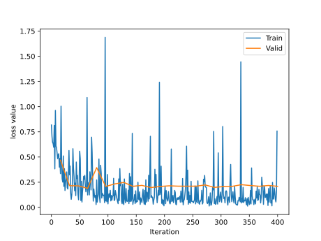
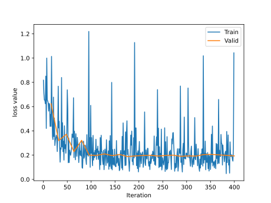
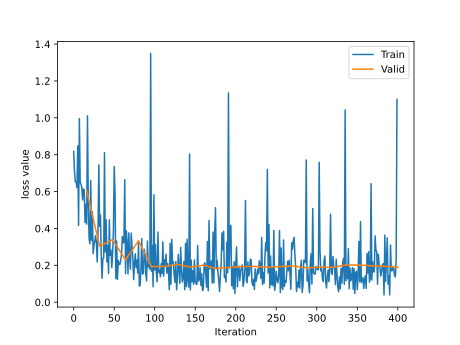

迁移学习：将source domain任务上的学习模型应用到target domain的任务

Finetune就是一种**迁移学习**。以人脸识别为例子，ImageNet作为source domain，人脸数据集作为target domain，一般source domain会比target domain大得多

对于一个模型，通常分为两个部分：feature extractor和classifier。Finetune一般是不改变feature extractor的权值(冻结卷积层)，并且改变classifier的权值，因为改变feature extractor的权值容易产生过拟合现象

Finetune步骤如下
* 获取预训练模型的参数
* 使用`load_state_dict()`把参数加载到模型中
* 修改输出层
* 固定feature extractor的参数，可以有两种方法
	* 固定卷积层的与训练参数，可以设置`requires_grad=False`或者`lr=0`
	* 可以通过`params_group`给feature extractor设置一个较小的学习率

### 不使用Finetune
首先捕获fc层的输入个数，然后构造新的fc层来替换原来的fc层


### 使用Finetune
#### 不冻结卷积层



#### 冻结卷积层
设置`requires_grad=False`



### 设置学习率为0/分组学习率
这里**不冻结卷积层**，而是对卷积层使用**较小的学习率**，对全连接层使用较大的学习率，需要在优化器里设置不同的学习率。首先获取全连接层参数的地址，然后使用 filter 过滤不属于全连接层的参数，也就是保留卷积层的参数；接着设置优化器的分组学习率，传入一个 list，包含 2 个元素，每个元素是字典，对应 2 个参数组。

代码示例
```python
# 首先获取全连接层参数的地址
fc_params_id = list(map(id, resnet18_ft.fc.parameters()))     # 返回的是parameters的 内存地址
# 然后使用 filter 过滤不属于全连接层的参数，也就是保留卷积层的参数
base_params = filter(lambda p: id(p) not in fc_params_id, resnet18_ft.parameters())
# 设置优化器的分组学习率，传入一个 list，包含 2 个元素，每个元素是字典，对应 2 个参数组
optimizer = optim.SGD([{'params': base_params, 'lr': LR*0}, {'params': resnet18_ft.fc.parameters(), 'lr': LR}], momentum=0.9)
```

实验结果如下<br>

效果介于冻结和不冻结之间

### 使用GPU的tips
利用三步使用GPU
1. 首先获取 device：`device = torch.device("cuda" if torch.cuda.is_available() else "cpu")`
2. 把模型加载到 device：`model.to(device)`
3. 在 data_loader 取数据的循环中，把每个 mini-batch 的数据和 label 加载到 device：`inputs, labels = inputs.to(device), labels.to(device)`
