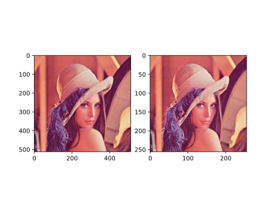

### 池化层
池化的目的是**下采样**
* 保留显著特征
* 降低特征维度
* 增大kernel的感受野

池化也可以提供一些**旋转不变性**，一方面使特征图变小，一定程度上避免过拟合；另一方面进行特征压缩，提取主要特征

#### 最大池化 nn.MaxPool2d()
```python
nn.MaxPool2d(kernel_size, stride=None, padding=0, dilation=1, return_indices=False, ceil_mode=False)
```
- `kernel_size`：池化核尺寸
- `stride`：步长，通常与 kernel_size 一致
- `padding`：填充宽度，主要是为了调整输出的特征图大小，一般把 padding 设置合适的值后，保持输入和输出的图像尺寸不变。
- `dilation`：池化间隔大小，默认为 1。常用于图像分割任务中，主要是为了提升感受野
- `ceil_mode`：默认为 False，尺寸向下取整。为 True 时，尺寸向上取整
- `return_indices`：为 True 时，返回最大池化所使用的像素的索引，这些记录的索引通常在反最大池化时使用，把小的特征图**反池化**到大的特征图时，每一个像素放在哪个位置

* 反池化
	* 将特征数值放到**池化时作为依据的位置**，即上文说的索引
* 上采样
	* 将特征数值按照**区域填充**的方式填充
* 反卷积
	* 将卷积后的特征图**完全还原**为原图片

最大池化代码示例
```python
import os
import torch
import torch.nn as nn
from torchvision import transforms
from matplotlib import pyplot as plt
from PIL import Image
from common_tools import transform_invert, set_seed

set_seed(1)  # 设置随机种子

# ================================= load img ==================================
path_img = os.path.join(os.path.dirname(os.path.abspath(__file__)), "imgs/lena.png")
img = Image.open(path_img).convert('RGB')  # 0~255

# convert to tensor
img_transform = transforms.Compose([transforms.ToTensor()])
img_tensor = img_transform(img)
img_tensor.unsqueeze_(dim=0)    # C*H*W to B*C*H*W

# ================================= create convolution layer ==================================

# ================ maxpool
flag = 1
# flag = 0
if flag:
    maxpool_layer = nn.MaxPool2d((2, 2), stride=(2, 2))   # input:(i, o, size) weights:(o, i , h, w)
    img_pool = maxpool_layer(img_tensor)

print("池化前尺寸:{}\n池化后尺寸:{}".format(img_tensor.shape, img_pool.shape))
img_pool = transform_invert(img_pool[0, 0:3, ...], img_transform)
img_raw = transform_invert(img_tensor.squeeze(), img_transform)
plt.subplot(122).imshow(img_pool)
plt.subplot(121).imshow(img_raw)
plt.show()
```

结果如下
```text
池化前尺寸:torch.Size([1, 3, 512, 512])
池化后尺寸:torch.Size([1, 3, 256, 256])
```

<br>如图，池化后图片大小降低

#### nn.AvgPool2d()
```python
torch.nn.AvgPool2d(kernel_size, stride=None, padding=0, ceil_mode=False, count_include_pad=True, divisor_override=None)
```
- `kernel_size`：池化核尺寸
- `stride`：步长，通常与 kernel_size 一致
- `padding`：填充宽度，主要是为了调整输出的特征图大小，一般把 padding 设置合适的值后，保持输入和输出的图像尺寸不变。
- `dilation`：池化间隔大小，默认为 1。常用于图像分割任务中，主要是为了提升感受野
- `ceil_mode`：默认为 False，尺寸向下取整。为 True 时，尺寸向上取整
- `count_include_pad`：在计算平均值时，是否把填充值考虑在内计算
- `divisor_override`：除法因子。在计算平均值时，分子是像素值的总和，分母默认是像素值的个数。如果设置了 divisor_override，把分母改为 divisor_override

```python
img_tensor = torch.ones((1, 1, 4, 4))
avgpool_layer = nn.AvgPool2d((2, 2), stride=(2, 2))
img_pool = avgpool_layer(img_tensor)
print("raw_img:\n{}\npooling_img:\n{}".format(img_tensor, img_pool))
```

输出如下
```text
raw_img:
tensor([[[[1., 1., 1., 1.],
          [1., 1., 1., 1.],
          [1., 1., 1., 1.],
          [1., 1., 1., 1.]]]])
pooling_img:
tensor([[[[1., 1.],
          [1., 1.]]]])
```

如果加上`divisor_override=3`，输出如下
```text
raw_img:
tensor([[[[1., 1., 1., 1.],
          [1., 1., 1., 1.],
          [1., 1., 1., 1.],
          [1., 1., 1., 1.]]]])
pooling_img:
tensor([[[[1.3333, 1.3333],
          [1.3333, 1.3333]]]])
```

#### nn.MaxUnpool2d()
```python
nn.MaxUnpool2d(kernel_size, stride=None, padding=0)
# 对图像进行最大值反池化
```
- `kernel_size`：池化核尺寸
- `stride`：步长，通常与 kernel_size 一致
- `padding`：填充宽度

代码示例如下
```python
# pooling
img_tensor = torch.randint(high=5, size=(1, 1, 4, 4), dtype=torch.float)
maxpool_layer = nn.MaxPool2d((2, 2), stride=(2, 2), return_indices=True)
img_pool, indices = maxpool_layer(img_tensor)

# unpooling
img_reconstruct = torch.randn_like(img_pool, dtype=torch.float)
maxunpool_layer = nn.MaxUnpool2d((2, 2), stride=(2, 2))
img_unpool = maxunpool_layer(img_reconstruct, indices)

print("raw_img:\n{}\nimg_pool:\n{}".format(img_tensor, img_pool))
print("img_reconstruct:\n{}\nimg_unpool:\n{}".format(img_reconstruct, img_unpool))
```

输出如下
```text
raw_img:
tensor([[[[0., 4., 4., 3.],
          [3., 3., 1., 1.],
          [4., 2., 3., 4.],
          [1., 3., 3., 0.]]]])
img_pool:
tensor([[[[4., 4.],
          [4., 4.]]]])
img_reconstruct:
tensor([[[[-1.0276, -0.5631],
          [-0.8923, -0.0583]]]])
img_unpool:
tensor([[[[ 0.0000, -1.0276, -0.5631,  0.0000],
          [ 0.0000,  0.0000,  0.0000,  0.0000],
          [-0.8923,  0.0000,  0.0000, -0.0583],
          [ 0.0000,  0.0000,  0.0000,  0.0000]]]])
```

### 线性层
线性层又称为**全连接层**(Fully Connected/Feed Forward)，其每个神经元与上一个层所有神经元相连，实现对前一层的线性组合或线性变换

代码如下
```python
inputs = torch.tensor([[1., 2, 3]])
linear_layer = nn.Linear(3, 4)
linear_layer.weight.data = torch.tensor([[1., 1., 1.],
[2., 2., 2.],
[3., 3., 3.],
[4., 4., 4.]])

linear_layer.bias.data.fill_(0.5)
output = linear_layer(inputs)
print(inputs, inputs.shape)
print(linear_layer.weight.data, linear_layer.weight.data.shape)
print(output, output.shape)
```

输出如下
```text
tensor([[1., 2., 3.]]) torch.Size([1, 3])
tensor([[1., 1., 1.],
        [2., 2., 2.],
        [3., 3., 3.],
        [4., 4., 4.]]) torch.Size([4, 3])
tensor([[ 6.5000, 12.5000, 18.5000, 24.5000]], grad_fn=<AddmmBackward0>) torch.Size([1, 4])
```

### 激活函数层
假设全是**线性变换**，那么无论多少个层叠加，最终都相当于是**一个线性层**，所以需要增加**非线性变换**来使多层神经网络具有更深度的含义

介绍几个非线性变换的激活函数层，图像和公式在此不列出，可以去[[../基本原理/常规激活函数|常规激活函数]]里看

#### nn.Sigmoid
特性
* 输出值在$(0,1)$，符合概率
* 导数范围是$[0,0.25]$，容易导致梯度消失
* 输出为非0均值，破坏数据分布

#### nn.tanh
- 特性
	- 输出值在$(-1, 1)$，数据符合 0 均值
	- 导数范围是 $(0,1)$，容易导致梯度消失

#### nn.ReLU
- 特性
	- 输出值均为正数，负半轴的导数为 0，容易导致死神经元
	- 导数是 1，缓解梯度消失，但容易引发梯度爆炸

为防止出现**死神经元**，还存在几种变式

##### nn.LeakyReLU
`negative_slope`调整负半轴斜率
##### nn.PReLU
`init`参数设置初始斜率，斜率可以学习
##### nn.RReLU
负半轴斜率**随机**取`[lower,upper]`之间的一个数


