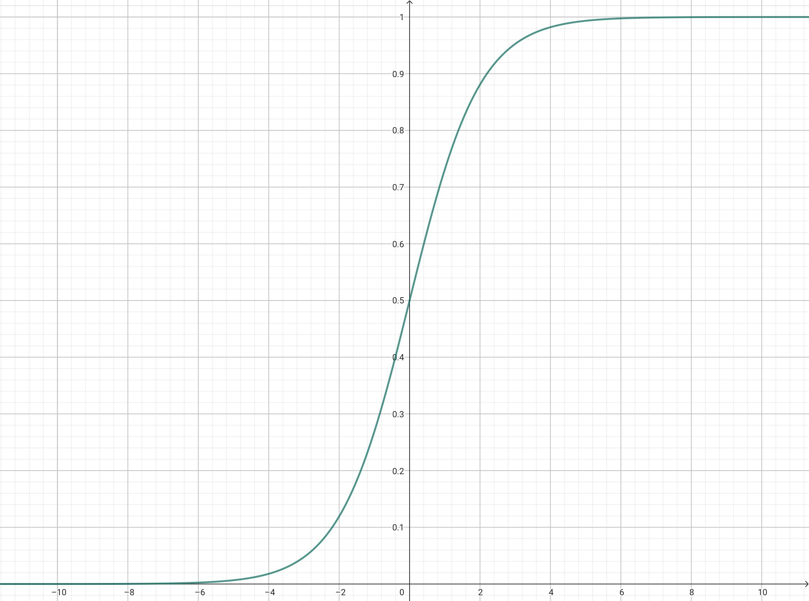
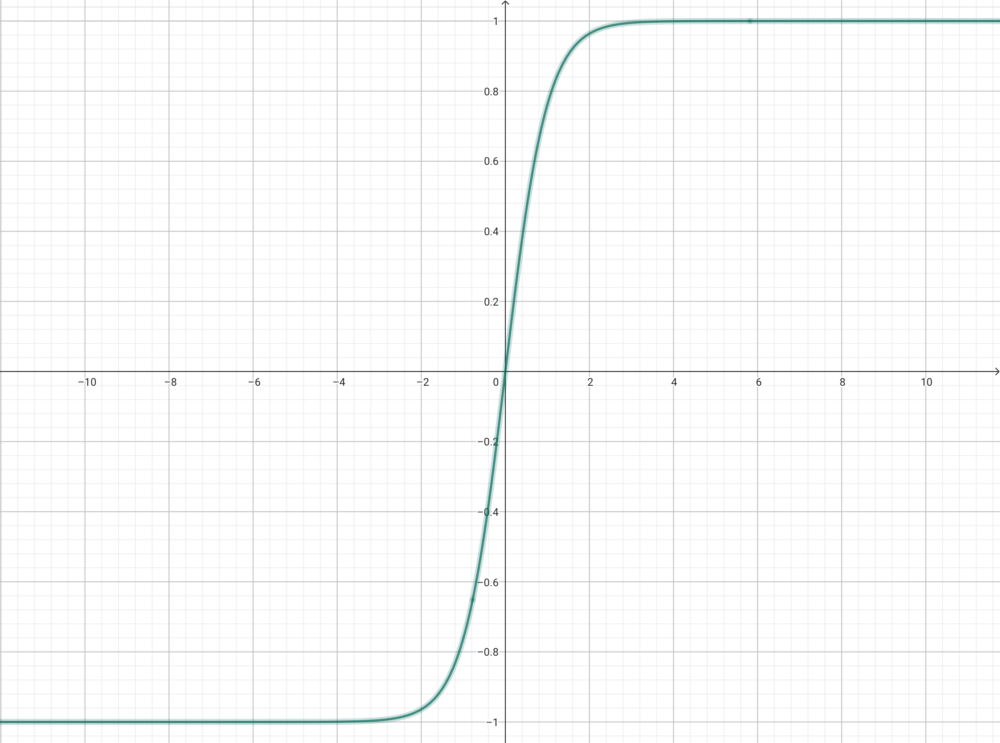
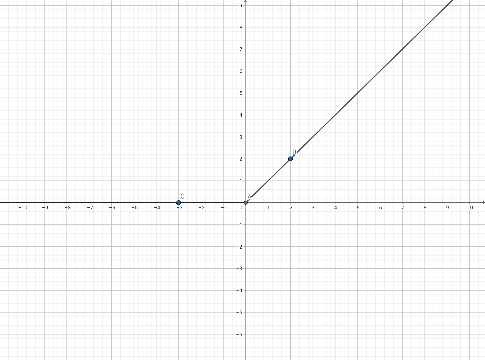
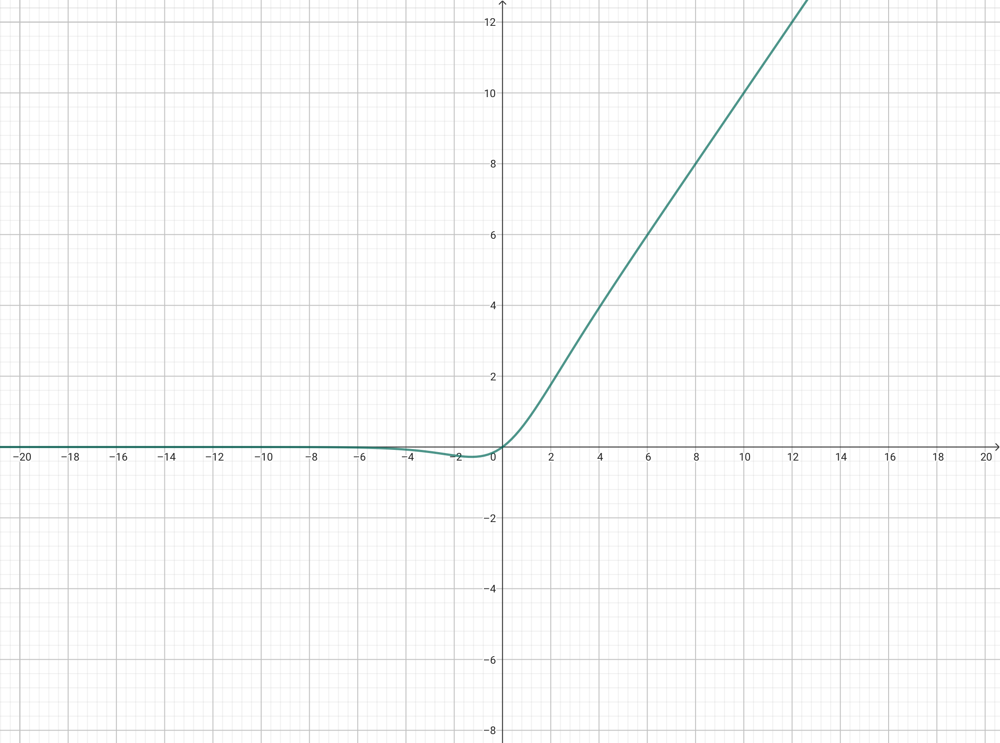

[参考博客](https://blog.csdn.net/hy592070616/article/details/120616475)
### Sigmoid函数

^83857e

表达式$$Sigmoid(x)=\frac{1}{1+e^{-x}}$$
 

### tanh函数
表达式$$tanh(x)=\frac{e^x-e^{-x}}{e^x+e^{-x}}$$
 

### ReLU函数

^c8ed49

表达式$$ReLU(x)=max(0,x)$$
 

存在一个变式**ReLU6**，限制了最大值不能超过6，在**移动端**低精度的情况下也能有较好的效果，公式如下$$\text{ReLU6}(x)=min(6,max(0,x))$$

在提出MobileNet v3之后，出现了一种新的**变体**，即**h-swish激活函数**，表达式如下$$\text{h-switsh}[x]=x\frac{\text{ReLU6}(x+3)}{6}$$

### Softmax函数
表达式$$Softmax(x)=\frac{e^{x_i}}{\sum_ie^{x_i}}$$
主要是将其归一化，同时使向量和为1，一般用于transformer机制

### Maxout函数
表达式$$Maxout(x)=max(\omega_ix_i+b_i)$$
主要是获取一组输入中的**最大值**来代表整个函数

其思路出场于论文《[Maxout Networks](https://arxiv.org/pdf/1302.4389)》

### Swish函数
表达式$$Swish(x)=x*Sigmoid(x)$$
更接近生物学的神经激活
 
